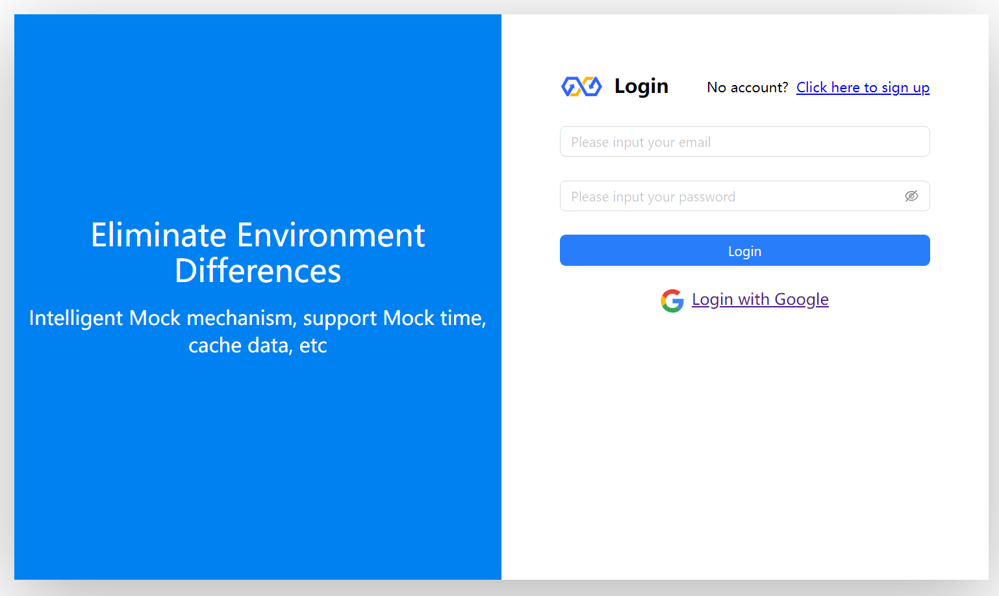
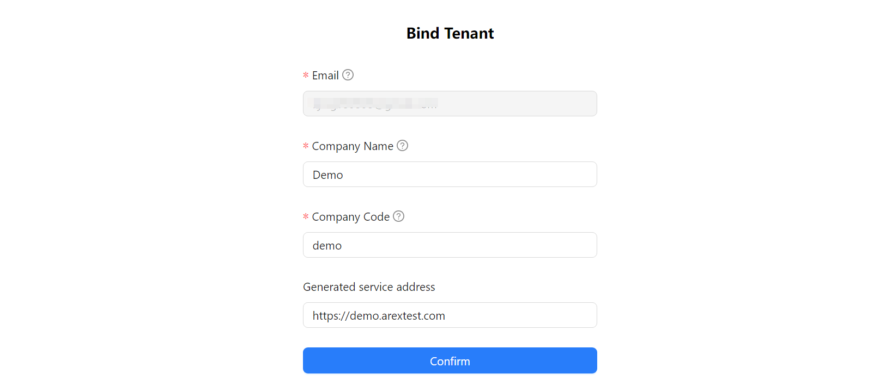
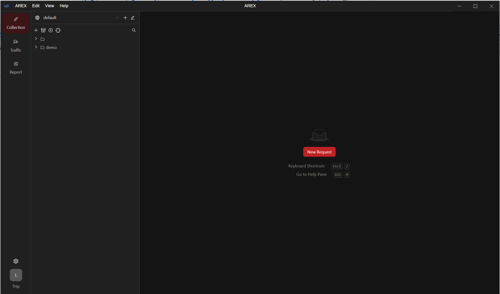
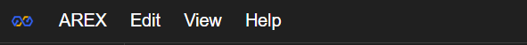
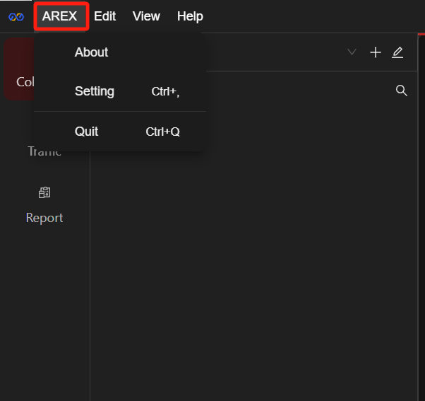
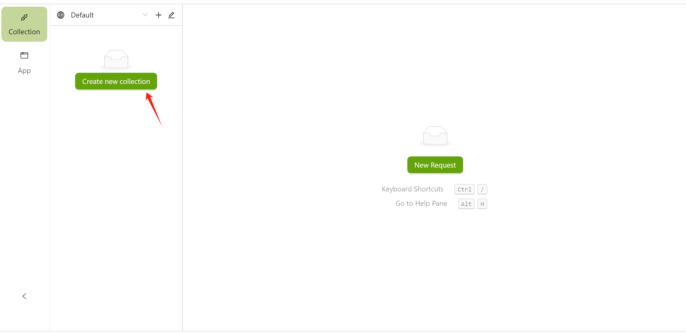
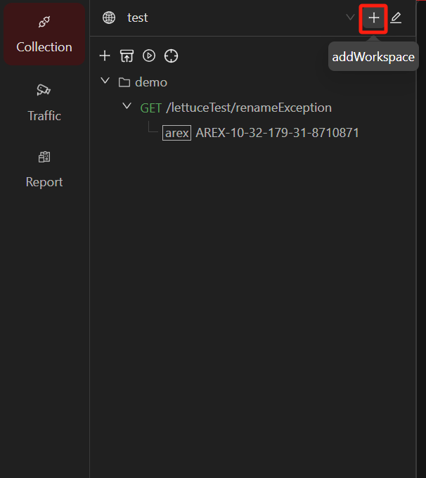

import { Callout } from 'fumadocs-ui/components/callout';

## 注册和登录

AREX Cloud 支持谷歌账号登录，或邮箱注册。已注册用户可通过密码登录。

点击 https://console.arextest.com/  进入 AREX Cloud 登录页面。

<Callout title="Note">提示：控制台的登录用户不同于 AREX 的用户。控制台用户是企业组织用来购买、管理 AREX 平台使用。</Callout>

## 创建组织

注册完成后，如果没有加入过任何组织，会提示用户用公司名建立自己的第一个组织。

## 控制台概览

## 角色管理

一个组织内有两个角色。

| **角色名称**                     | **访问控制权限** | **计费权限** | **组织管理权限** |
| -------------------------------- | ---------------- | ------------ | ---------------- |
| 组织管理员 | 有               | 有           | 有               |
| 使用者     | 无               | 无           | 无               |

## 添加成员

组织管理员可以通过输入新用户的邮箱地址来发送邀请，被邀请用户默认被设置为“使用者”角色。

添加成功后，新成员将收到邮件通知。

## 下载应用

**组织管理者**可前往 Dashboard 页面点击下载最新版本客户端，或者前往官网的下载页面自行下载。

**使用者**可通过邀请邮件中的下载链接下载客户端。

## 登录 AREX 平台

管理员创建组织后，组织成员可通过本地客户端登录。

首次登录需要输入邮箱，邮箱收到验证码后点击 **Login** 完成登录。

## 客户端界面组成

AREX 客户端界面主要包含菜单栏、侧边栏、工作台三大区域。

### 菜单栏

点击 **AREX：**

- About：查看当前客户端版本并更新版本。
- Setting：界面设置，切换页面暗黑/明亮模式、中/英文模式等操作。
- Quit：退出客户端。

 

### 侧边栏

 

- **Workspace**：
    - 点击下拉菜单切换 Workspace；点击右侧 **+** 新建一个工作区；
    - 点击图标设置当前工作区。
- **Collection**：查看常规测试用例和比对测试用例。
    - **+**：新建一个请求集合。
    - 导入导出按钮：将用例集合（目前仅支持 Postman 格式）导入至 AREX，或将 AREX 用例进行导出。
    
    - 批量运行：批量运行多个测试用例。
- **Traffic**：创建应用，查看实时录制用例。
- **Report**：查看回放报告、进行回放测试。

### 工作台

工作台是进行接口测试、回放测试、比对测试等操作时的主要区域。标签栏可以快速管理各种请求、集合、回放，右上角可以快捷选择环境。

#### 切换环境

根据需要，可以在页面右上角，快速切换为你所需要的环境。选中相应的环境，即可访问该环境中的变量。

## 新建集合

通过建立集合将各类请求进行分组管理，可以帮助你更好地管理请求。

点击左侧菜单栏 **Collection** 中 **Create new collection** 按钮，新建一个集合：

创建完成后，可以在左侧菜单栏管理集合。集合下还可以新增子集/文件夹。

## 新建工作区

首次登陆时将进入默认工作区。你可以创建不同的工作区供自己使用，也可以邀请你的团队在你的工作区中协作管理 Collection、共享 Environment 等。

1. 点击菜单栏右上方的 “**+**” 图标可以新建一个工作区。
    
    

2. 在左侧输入框中为你的工作区命名并点击 “**√**” 图标完成创建。

    

3. 点击编辑按钮编辑工作区。

    **Overview**：管理员可以在这里修改工作区的名称、查看团队成员并修改成员权限、删除工作区。

    

    **Labels**：管理员及可编辑成员可在该页面添加测试用例标签，方便管理测试用例。

    

## 协作功能

AREX 提供协作功能，你可以邀请其他人加入你的工作区，在同个工作区中进行在线协作。加入工作区的成员可以共享环境、**Collection** 中测试集合及测试用例等资源。如需邀请成员加入某工作区：

点击工作区编辑按钮，通过邮箱来邀请你的组织成员加入当前工作区。填写对方邮箱并为其设置权限后，点击 **Send Invites** 发送邀请，随后邀请人员将接收到邀请邮件，点击邮件中链接即可接受邀请，加入到工作区中。

权限分为管理员（Admin）、可编辑成员（Editor）、只读成员（Viewer）三种类型。
    

其中：
    
- **Admin**：管理员权限，可以管理工作区中详细信息、删除工作区、并可为成员设置权限。
- **Editor**：可以创建并编辑工作区中的资源（如测试用例）。
- **Viewer**：不可对工作区中数据进行编辑操作，可以查看和导出工作区的资源。
