import { Callout } from 'fumadocs-ui/components/callout';

## Registration and Login

AREX Cloud supports Google account login or email registration. Registered users can log in with their password.

Click https://console.arextest.com/ to access the AREX Cloud login page.

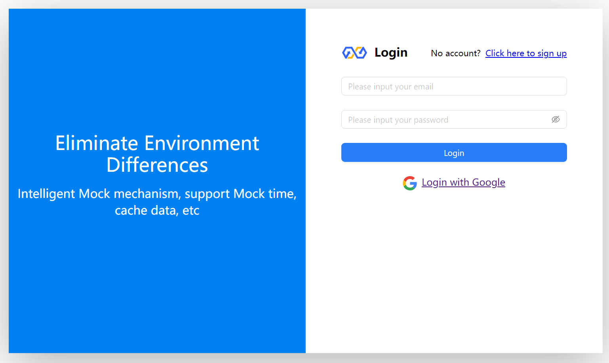

<Callout title="Note">The user logging into the console is different from the AREX user. Console users are enterprise organization members responsible for purchasing and managing the use of the AREX platform.</Callout>

## Create Organization

After registration, new users must create an organization using their company name.

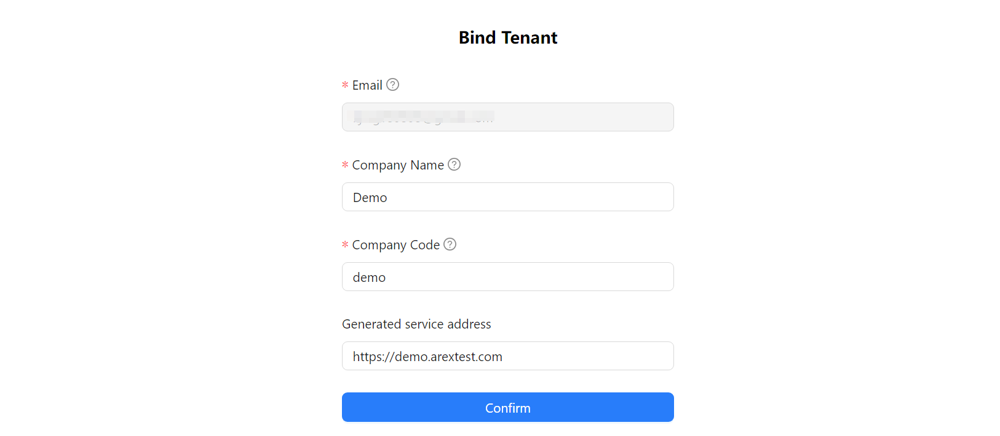

## Dashboard Overview

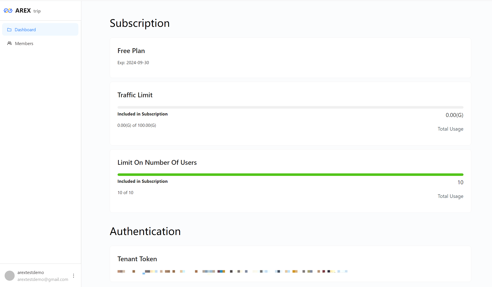

## Role Management

Within an organization, there are two default roles.

| **Role Name**          | **Access Control Permissions** | **Billing Permissions** | **Organization Management Permissions** |
|------------------------|--------------------------------|------------------------|------------------------------------------|
| Organization Admin    | Yes                            | Yes                    | Yes                                       |
| User                   | No                             | No                     | No                                        |

## Add Members

Organization admins can invite new users to join the current organization by entering their email addresses. Invited new users are assigned the default role of "User." Afterward, new members must register and log in through their email to join the organization.

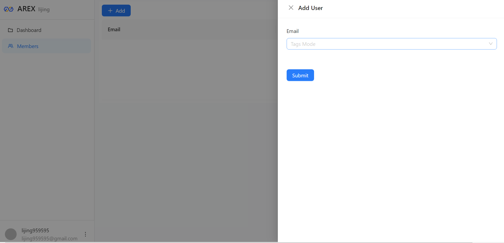

## Download AREX App

To get started, download and install the latest version of the AREX desktop app.

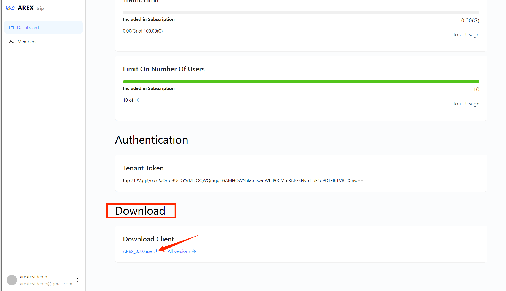

## Log into the AREX app

When you're ready, open the AREX desktop app and login with your email.

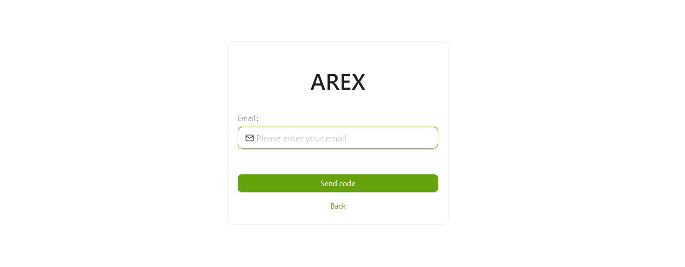

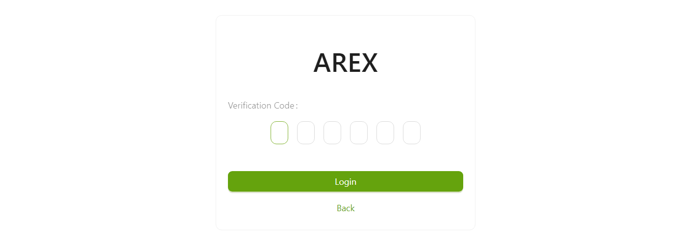

## The AREX Interface

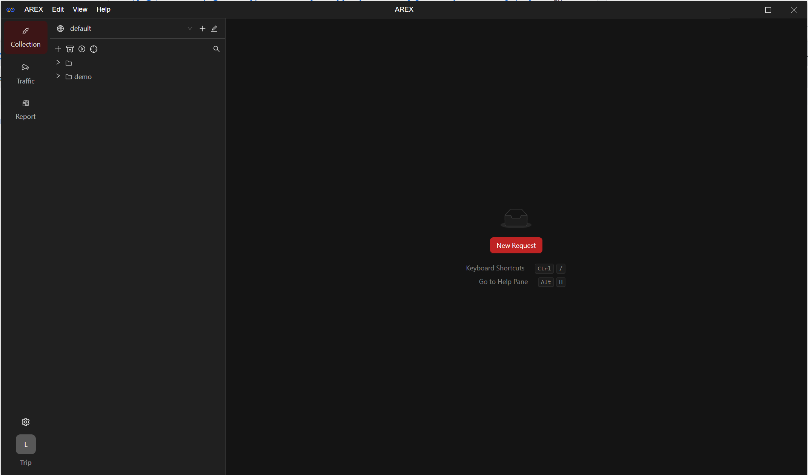

The AREX app interface primarily consists of three main areas: Header, sidebar, and workbench.

### Header

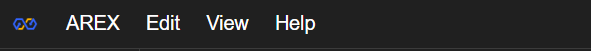

Click on **AREX：**

- About: View and update the client version.
- Setting: Interface settings, switch page dark/bright mode, Chinese/English mode and other operations.
- Quit: Quit AREX client.

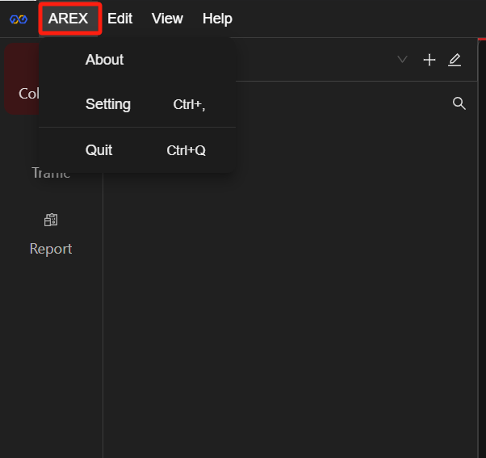 

### Sidebar

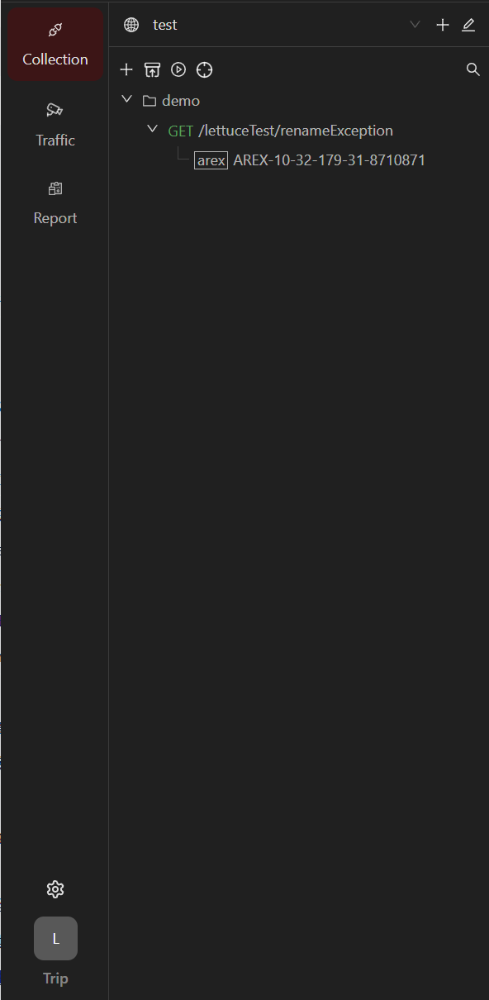 

- Workspace(https://webresource.c-ctrip.com/ares2/flight/arex/1.0.3/default/static/img/c1.workspace.icon.png)**Workspace**：
    - Click on the dropdown menu to switch workspaces; click the **+** on the right to create a new workspace;
    - Click the  icon to set the current workspace.
- **Collection**: View regular test cases and comparison test cases.
    - **+**: Create a new request collection.
    -  Import/Export: Import case collections (currently only supports Postman format) into AREX, or export AREX cases.
    
    -  Batch Run: Execute multiple test cases in batch.
- **Traffic**: Add an application and view real-time captured test cases.
- **Report**: View reports, and run tests.

### Workbench

The Workbench is the main area for interface testing, playback testing and other operations. The tab bar allows for quick management of various requests, collections, and playbacks. In the top right corner, you can quickly select an environment.

#### Switching Environments

As needed, you can quickly switch to the environment you need in the top right corner of the page. By selecting the appropriate environment, you can access the variables in that environment.

### Creating a New Collection

By creating a collection, you can group various requests for better management.

Click the **Create new collection** button in the **Collection** section of the left menu bar to create a new collection:

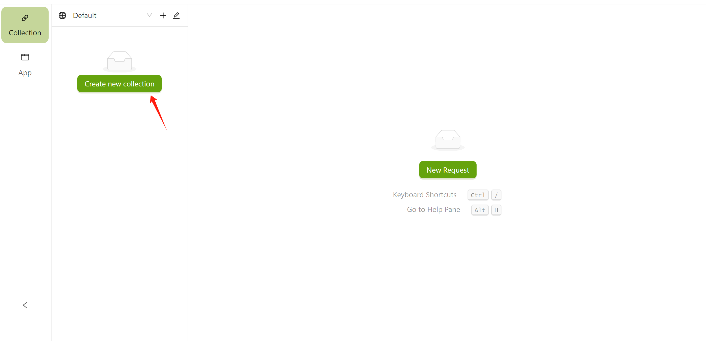

After creation, you can manage the collection in the left menu bar. You can also add **sub-collections/folders** under the collection.

### Creating a New Workspace

Upon first login, you will enter the default workspace. You can create different workspaces for personal use or invite your team to collaborate in your workspace to manage Collections, share Environments, etc.

1. Click the "**+**" icon in the top right corner of the menu bar to create a new workspace.

    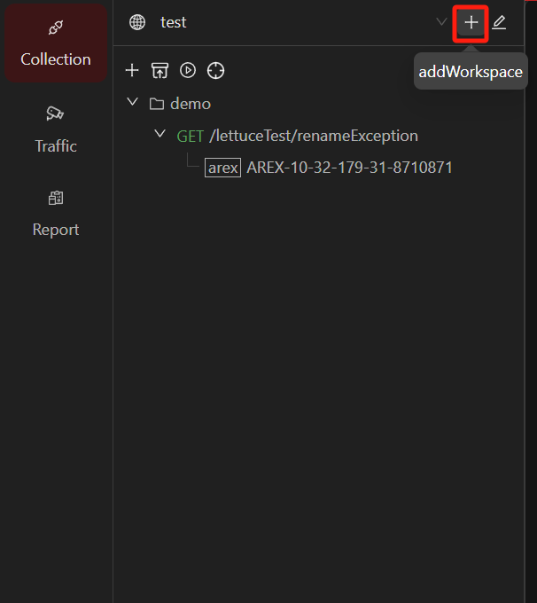

2. Enter a name for your workspace in the left input box and click the "**√**" icon to complete creation.

    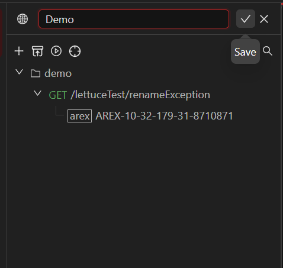

3. Click the edit button to edit the workspace.

   **Overview**: Administrators can modify the name of the workspace here, view team members, change member permissions, and delete the workspace.

    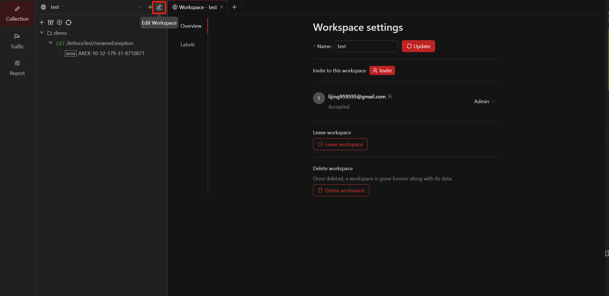

   **Labels**: Administrators and members with editing rights can add test case labels on this page, which helps in managing test cases.

    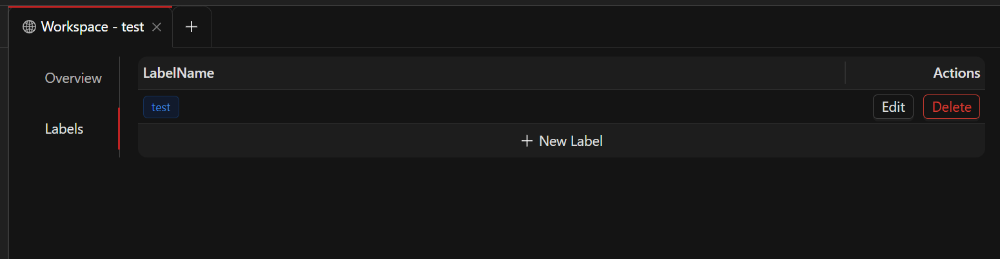

### Collaborate with your team

AREX offers collaboration features, allowing you to invite others to join your workspace for online collaboration. Members of a workspace can share environments, test collections, and test cases in **Collection**. To invite members to a workspace:

Click the workspace edit button and invite your team members to the current workspace via email. Enter their email address, set their permissions, and click **Send Invites**. The invitees will receive an invitation email, and by clicking the link in the email, they can accept the invitation and join the workspace.

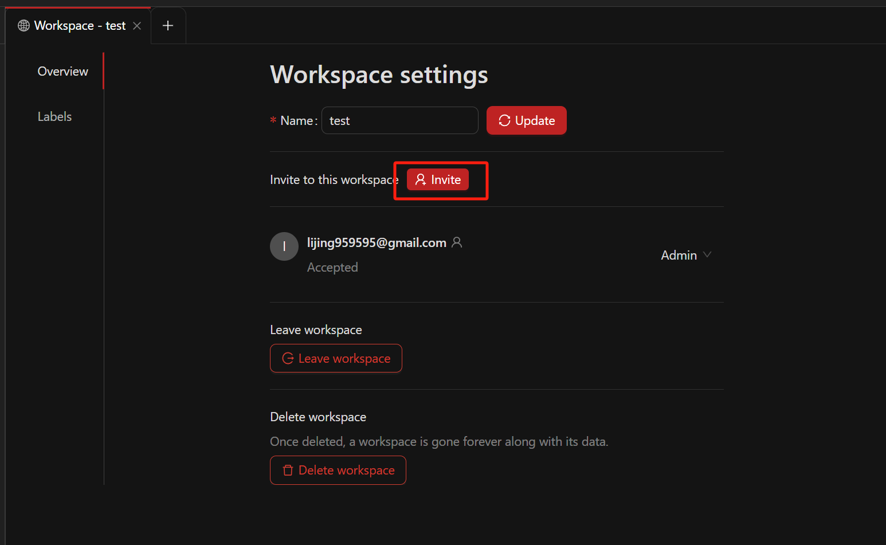

Permissions are divided into three types: Administrator (Admin), Editor, and Viewer.
    
< img src="https://github.com/arextest/arex/assets/118187476/b7fc96b4-5990-4502-b818-184f7fe94ec8" alt="Invite" width="700" height="" />

Where:
    
- **Admin**: Administrative rights, can manage detailed information in the workspace, delete the workspace, and set permissions for members.
- **Editor**: Can create and edit resources in the workspace (such as test cases).
- **Viewer**: Cannot edit data in the workspace, but can view and export resources from the workspace.
