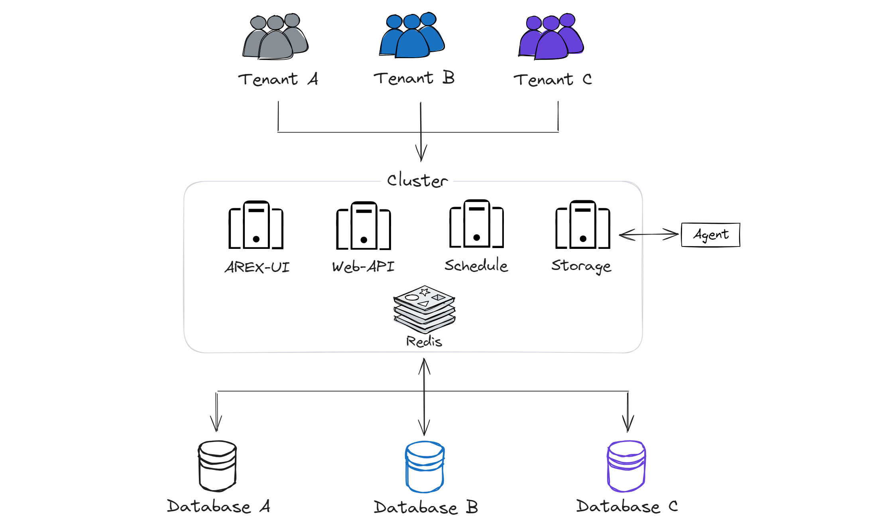
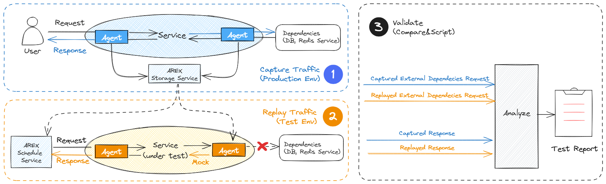

AREX is an open-source traffic replay testing platform based on real requests and data. It automates testing by recording online real traffic and replaying it in the testing environment.

AREX Cloud is a SaaS solution based on AREX, providing services through the cloud. It's designed for out-of-the-box use and provides professional technical support.

## Core Features

AREX Cloud inherits the core advantages of AREX:

**✔ High Coverage Without Writing Tests**
- No code intrusion, minimal integration cost
- No need to write test cases, a massive amount of online requests ensures high coverage

**✔ Automate Testing with Mocks, No Need to Setup Test-environment**
- During replay, application avoids actual calls to the database and other downstream components by mocking dependencies. It utilizes previously captured requests and responses, eliminating the need to maintain active dependencies for testing.
- Supports test **WRITE calls**, including validation of database, message queue, Redis data, and even runtime memory data without generating dirty data during testing. Replace external dependencies with mock data.
- Supports automatic data collection and mocking for various mainstream technology frameworks, and supports local time, caching, and accurately reproduces the production data environment during replay.

**✔ Secure and Stable**

- In terms of data security, it offers comprehensive permission control and traffic desensitization mechanisms.
- Code isolation is implemented along with health management, and during system busy times, it intelligently reduces or stops data collection frequency, not affecting online applications.

**✔ Lower test noise**
- Strategies to manage noise involve executing tests repeatedly to detect inconsistent fields and employing methods such as time mocking to prevent session token expiration.

Additionally, it has the following extra advantages based on the open-source version:

**✔ Ready to Use Out of the Box**

Services are provided through the cloud, eliminating the need for user deployment and maintenance. It's ready to use immediately with lightweight operations.

**✔ Easy Maintenance**

Maintenance and upgrades are handled by the service provider, so users don't need to worry about software updates and system maintenance.

**✔ Professional Technical Support**

Technical assurance is provided by a professional operations and maintenance team. During use, any issues encountered can be addressed with timely technical assistance and SLA services such as fault maintenance.

## Architecture

## How it Works

**1. Traffic Capture:**

  - The AREX Java Agent, attached to Java applications in the production environment, records both inbound traffic to your API and outbound traffic to its dependencies, including the resulting responses.
  - Recorded data is forwarded to AREX Storage Service for storage in a MongoDB database.

**2. Traffic Replay:**

  - The Schedule Service replays the recorded application traffic back to the same application in the test environment, simulating production environment behavior.
  - When the application try to call to any dependencies like DBs, other services, AREX Agent will intercept and provide the previously recorded dependency response.

**3. Result Verification and Reporting:**

  - AREX compares API responses and outbound traffic to dependencies, like databases or external services, with previously recorded traffic, and then generates a report.
