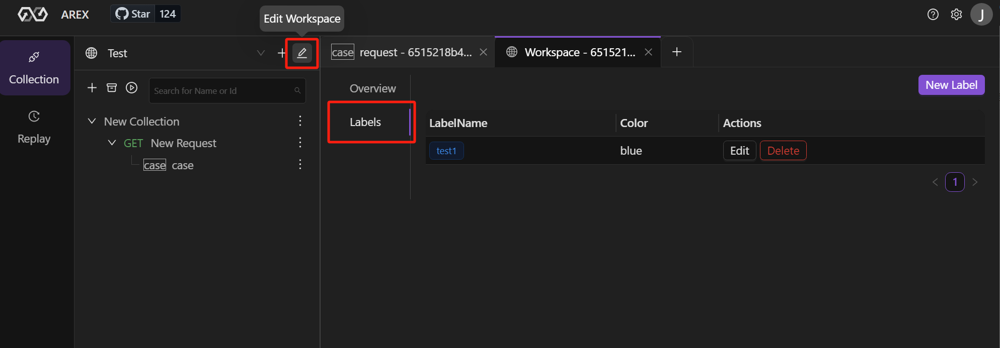
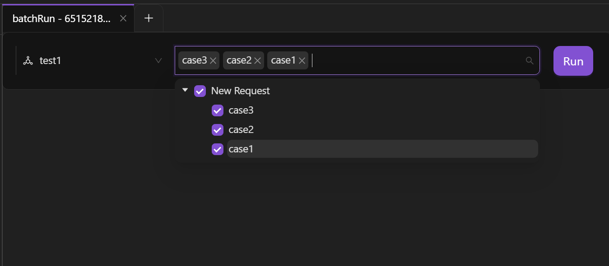
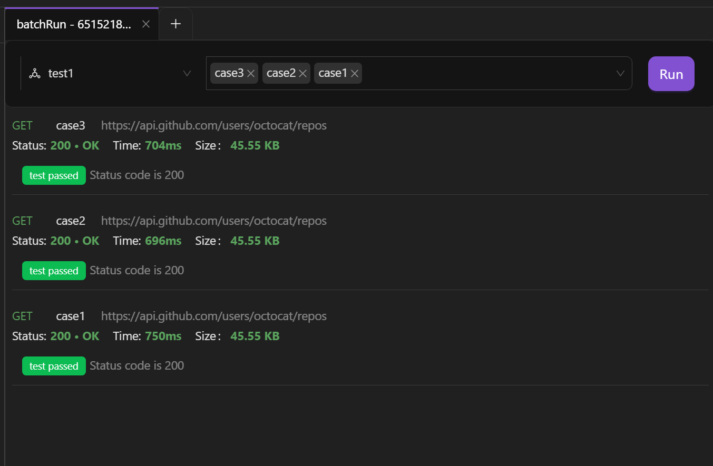

AREX allows you to automate API testing by running a collection of saved requests. This is a convenient way to perform automated API testing on a large number of test cases at once, rather than running each test case individually.

## Scenarios

**Batch run test cases**. When testing multiple scenarios for the same URL, you can save requests in different scenarios as test cases and run it directly the next time without having to re-add the request details. The **Batch Run** enables you to run multiple test cases in a collection at once, making regression testing more efficient and convenient.

## Create colletions to store test cases

1. Select **Collection** in the sidebar and select the **+** icon to create a new collection.

    

2. Select **Add Request** from the dropdown list of the collection to create a new request, and then select **Save**.

    

3. Select **Add Case** frome the dropdown list of the request to create a new test case. Test cases will automatically inherit the configuration of Request, reducing the cost of designing test cases.

    

4. You can categorize your test cases by adding tags. Hover over the **Add Tag** and select the  icon.

    

    Tags can be pre-configured by selecting the **Edit Workspace** icon >> **Labels** tab.

    

5. **Description** of test cases makes it easier for others to understand the purpose and expected results of the test cases, improves readability, and provides a better understanding of the testing content. To add a description, move your cursor to **description** and select the  icon.

## Batch Run

1. Select **Batch Run** from the dropdown list of the collection which you want to run.

    

    Or you can hover over the  icon in the sidebar and select **Batch Run**. All collections within the current **workspace** will be selected in this way.

    

2. Select the test cases from the list and select **Run Case** to run.

    

You can view the test results after running.

