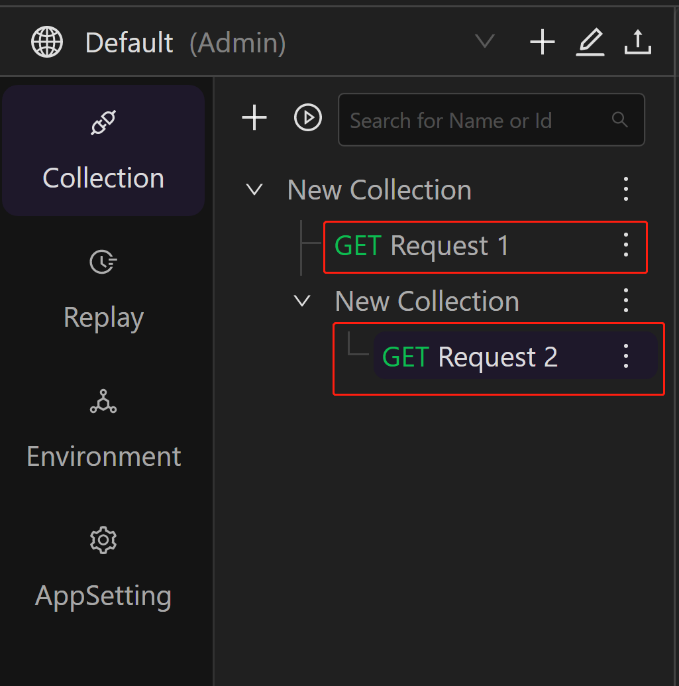
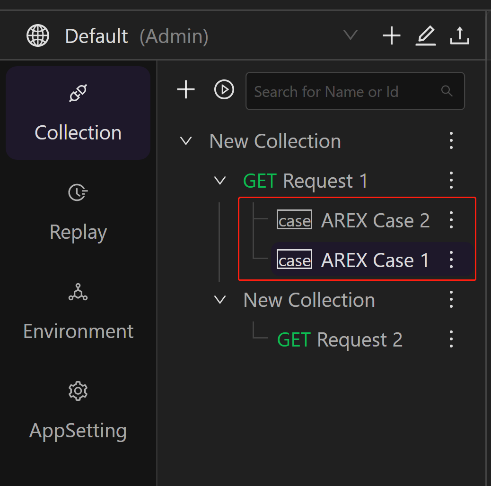
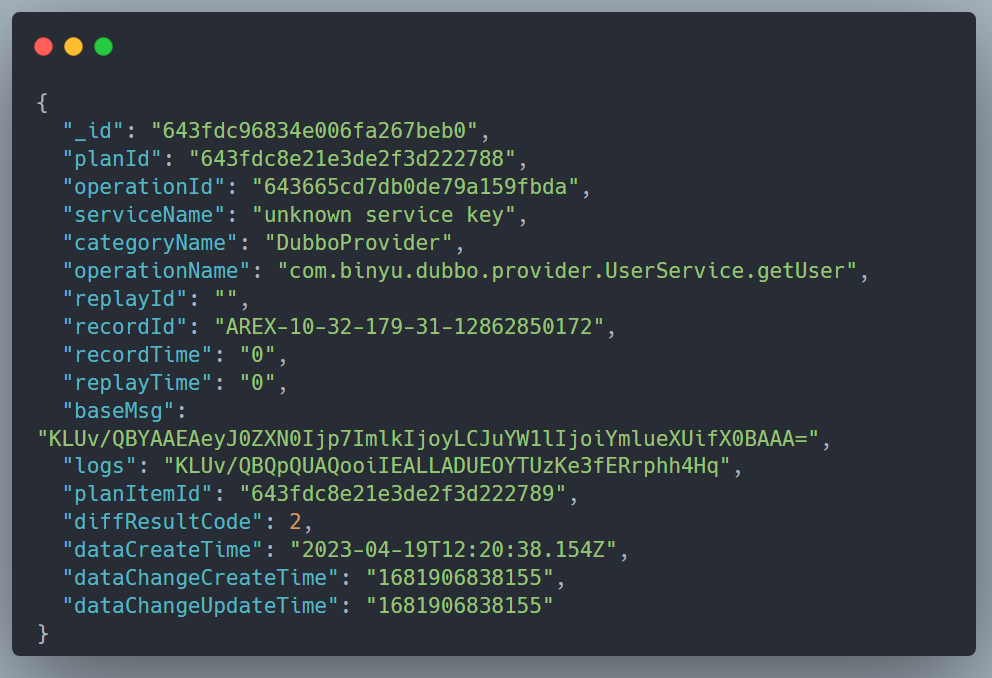

[AREX](https://github.com/arextest) 原理是通过 AREX Agent 注入指定的 Java 进程，录制的时候记录请求/应答以及进程对外的请求/应答，然后，根据 TransactionID 将这些信息存储到数据库中。

如上图所示，AREX 回放的时候从数据库拿到请求并进行回放，具体步骤如下：

1. Schedule 服务向被测试服务发送请求，请求的报文头中包含了 `arex`。
2. 被测试服务已经装载了 Agent（代理），在收到请求后，会调用相应的代码。在调用栈中，会存储 replayID（回放ID）。
3. 当调用链路访问到 MySQL 数据库时，注册代码会检测到当前处于回放状态。这时，系统会从MongoDB数据库中获取之前录制的MySQL应答数据，并返回给函数调用者，而不再访问实际的MySQL数据库。
4. 同样的处理方式也适用于 Redis 请求。此外，新版本的请求也会被记录到数据库中。

AREX 使用 Mongodb 作为其数据库系统，许多功能和逻辑都与数据表有关。例如，应用程序的注册、请求和响应的记录都存储在数据表中。此外，回放计划、回放结果以及中间数据等信息也存储在数据表中。 由于 AREX 的调用链和数据读写具有一定的复杂性，因此在用户使用过程中可能会遇到一些非预期的问题，如注册失败或录制不成功等。在这种情况下，最简单直接的解决方法就是查看数据表，以便了解问题的原因。

所以本文收集了一些 AREX 的数据表及其含义供共深入使用的同学了解，减少一些学习成本。

以下是在 0.2.8 及以上版本的 AREX 中，MongoDB 数据库的集合名称及其相关描述。

| 数据库 Collection Name        | 用途                                                         | 描述与检查                                                   | 数据量级 |
| ----------------------------- | ------------------------------------------------------------ | ------------------------------------------------------------ | -------- |
| App                           | 用于存储 AREX Agent 注册过的应用                             | `appid` 是前端展示的字段，`appName` 这个字段没有使用，可忽略。检查技巧：如前端没有正常显示某个应用，可在此表查询 | 10+      |
| CaseSummary                   | 根据对比差异的分类进行聚合的场景表                           | 对比差异分为大类和小类，大类表示更广泛的差异，而小类为在大类之下的更具体的差异，该表为智能分析比对结果时的中间表 | 20,000+  |
| ConfigComparisonDecompression | 对比配置——字段压缩类型配置表                                 |                                                              |          |
| ConfigComparisonExclusions    | 对比配置——节点忽略表                                         | 如果配置了这张表，回放比对时会跳过这些节点，不进行比对。如 timestamp、随机数、ip 等对比对结果意义不大的数据。 |          |
| ConfigComparisonInclusions    | 对比配置——节点比较表                                         | 如果配置了这张表，代表只比较配置的节点。与 ConfigComparisonExclusions 功能相反。暂时未使用。 |          |
| ConfigComparisonListSort      | 对比配置——数组排序字段表                                     |                                                              |          |
| ConfigComparisonReference     | 对比配置——节点 reference 关系表                              |                                                              |          |
| DynamicClass                  | 动态类配置表                                                 | 前端页面中动态类配置从此获取 |          |
| Environment                   | 环境变量配置表                                               | 配置的环境变量表                                             |          |
| FSFolder                      | **Collection**——文件夹列表                                   | 集合下文件夹 (Folder) 列表，类比与 Postman 中的子集合 |          |
| FSInterface                   | **Collection**——接口请求列表                                 | 集合/文件夹下接口请求列表        |          |
| FSCase                        | **Collection**——用例列表                                     | 接口请求下测试用例表（FSCase在FSInterface下层），`add` 字段存储的是用例的 HTTP Method 和 URL 地址 |          |
| FSTraceLog                    | **Collection** 的增删改查日志记录                            | 当接口测试集合误操作时，可以用于恢复 Collection              |          |
| FSTree                        | Collection 树形结构表，和 FSFolder、FSInterface、FSCase 配合使用 |                                                              |          |
| Instances                     | 搭载 Agent 的机器列表                                        | Agent 每 2 分钟汇报一次机器状态，该记录有 3 分钟的 TTL Index，超时自动删除。检查技巧：检查当前有状态的被测试服务（包含agent且已经启动） |          |
| Label                         | **Collection**——Lable 配置表                                 | 前端页面中为测试用例设置的标签     |          |
| MessagePreprocess             | 预处理表                                                     |                                                              |          |
| PreprocessConfig              | 预处理配置表                                                 |                                                              |          |
| RecordServiceConfig           | 应用录制配置表                                               |                                                              |          |
| ReplayCompareResult           | 用例对比详情表，里面记录了每个用例（包括外部调用）的对比结果 | 查看Case的比对结果，如下表，baseMsg 等是用 zstd 压缩的，解压后才能看到明文  | 400,000+ |
| ReplayPlan                    | 回放报告——计划表（由 Schedule 服务生成）                     | 其中 `appid` 就是前端页面中看到的应用名  | 700+     |
| ReplayPlanItem                | 回放报告——接口表                                             | 回放报告中所有访问的接口列表，由 Schedule 服务生成 | 13,000+  |
| ReplayRunDetails              | 回放详情页                                                   | 由 Schedule 服务生成，与 ReplayCompareResult 中有部分重复    | 212,000+ |
| ReplayScheduleConfig          | 应用回放配置表                                               |                                                              |          |
| ReportDiffAggStatistic        | 回放报告——差异点统计表                                       | 回放报告的配置                                               | 1900+    |
| ReportPlanItemStatistic       | 回放报告——接口表                                             | 由 Report 服务生成                                           | 12,000+  |
| ReportPlanStatistic           | 回放报告——计划表                                             | 由 Report 服务生成                                           |          |
| RollingConfigFileMocker       | 录制用例——配置表                                             | 录制用例的配置                                               |          |
| RollingDatabaseMocker         | 录制用例——Database 表                                        | Database 类型的录制数据                                      | 12,000+  |
| RollingDubboConsumerMocker    | 录制用例——Dubbo Consumer 表                                  | Dobbo Consumer 类型的录制数据                                |          |
| RollingDubboProviderMocker    | 录制用例——Dubbo Provider 表                                  |    Dubbo Provider 类型的录制数据                                                          |          |
| RollingDynamicClassMocker     | 录制用例——动态类表                                           |          动态类的录制数据                                                    | 28,000+  |
| RollingHttpClientMocker       | 录制用例——Http Client 表                                     |      Http Client 类的录制数据                                                        |          |
| RollingRedisMocker            | 录制用例——Redis 表                                           |           Redis 类的录制数据                                                    | 42,000+  |
| RollingServletMocker          | 录制用例——Servlet 表                                         |          Servlet 类的录制数据                                                    | 21,000+  |
| PinnedDatabaseMocker          | 固化用例——Database 表                                        | Database 类型的固化数据，在将录制用例进行固化后，从 RollingDatabaseMocker 中获取 |          |
| PinnedDynamicClassMocker      | 固化用例——动态类表                                           | 动态类的固化数据                                             |          |
| PinnedHttpClientMocker        | 固化用例——Http Client 表                                     |     Http Client 类的固化数据                                                         |          |
| PinnedRedisMocker             | 固化用例——Redis 表                                           |       Redis 类的固化数据                                                       |          |
| PinnedServletMocker           | 固化用例——Servlet 表                                         |       Servlet 类的固化数据                                                       |          |
| SceneInfo                     | 根据对比差异的分类进行聚合的场景表                           | 聚合用的场景表                                               |          |
| Service                       | 应用服务表                                                   | AREX 默认会为每个应用创建一条记录                            |          |
| ServiceOperation              | 接口表                                                       |                                                              |          |
| User                          | 用户表                                                       |                                                              |          |
| UserWorkspace                 | 用户-工作区关系表                                            |                                                              |          |
| logs                          | 系统日志表                                                   |                                                              | 633,000+ |
