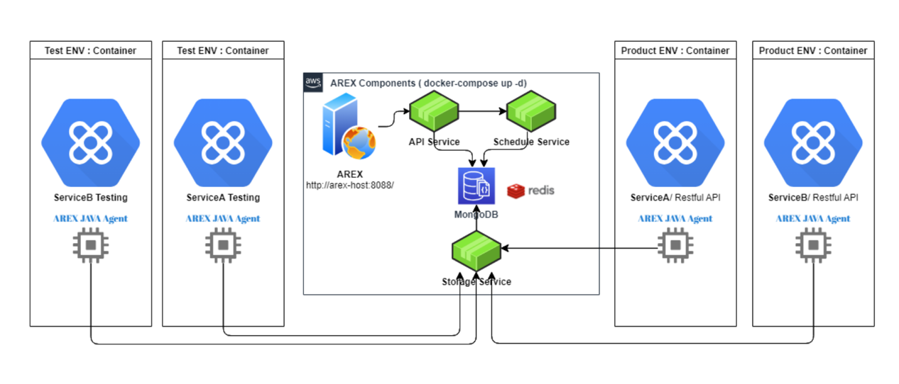
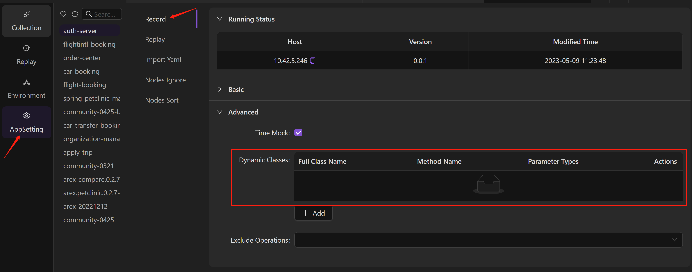
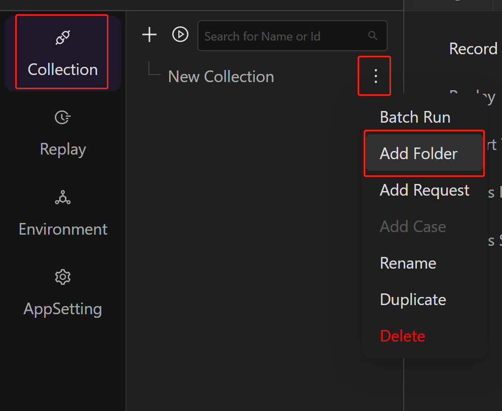
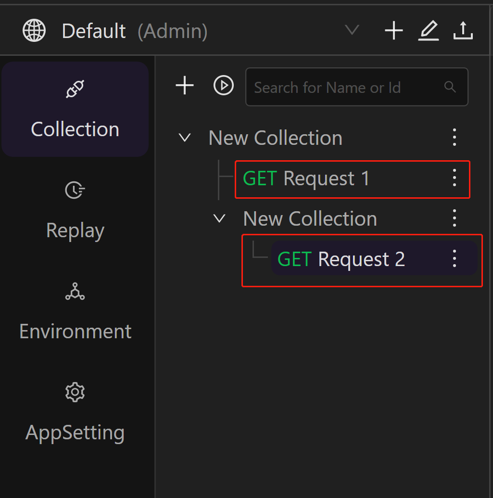
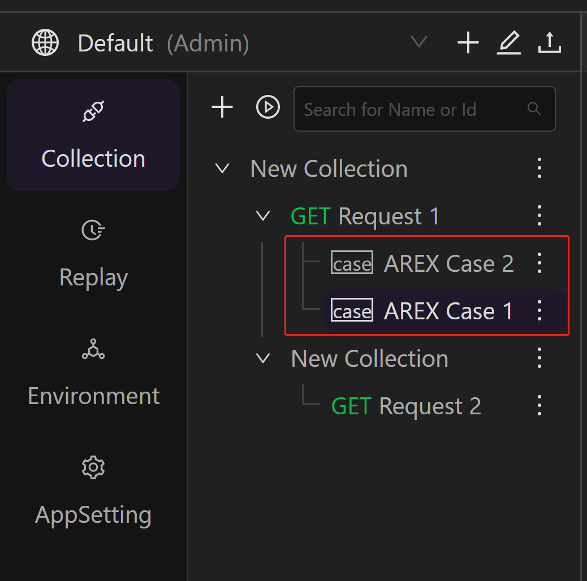
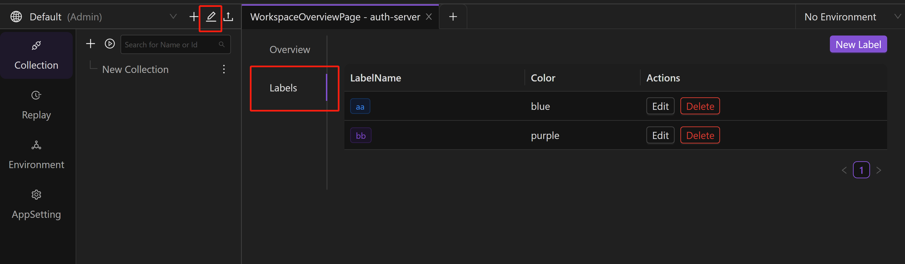
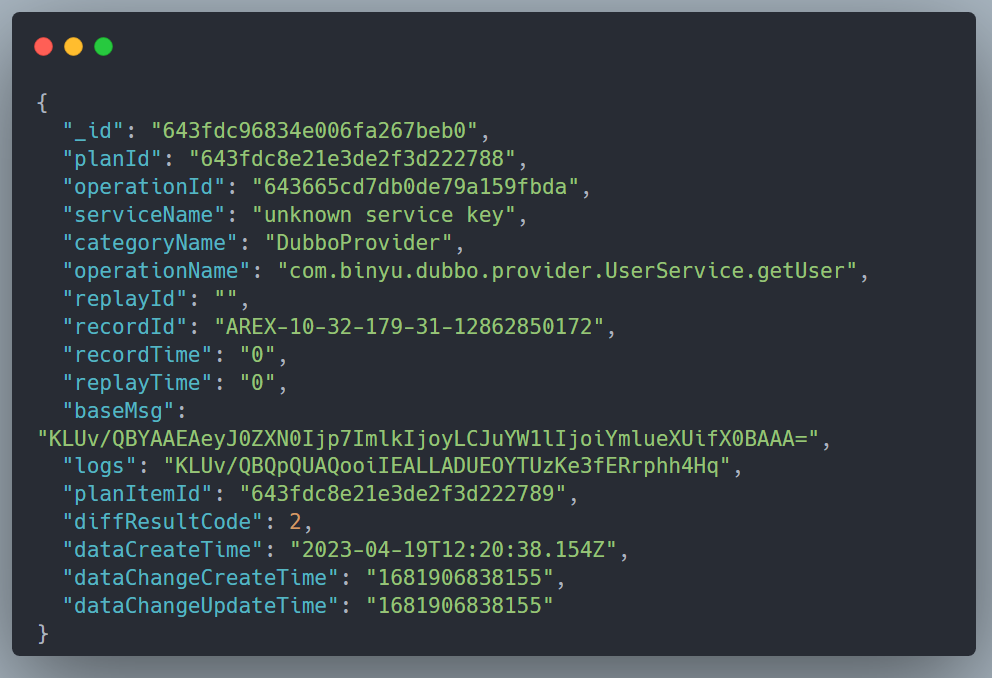
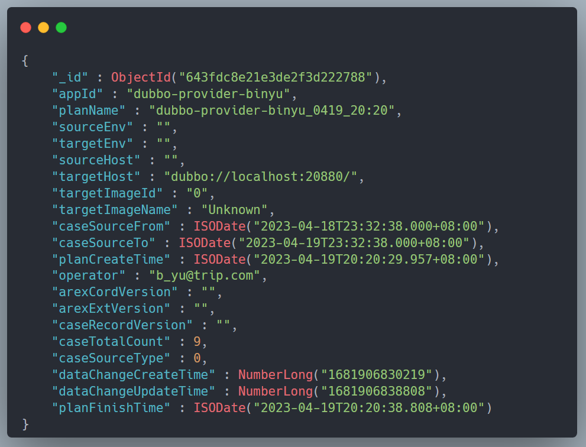
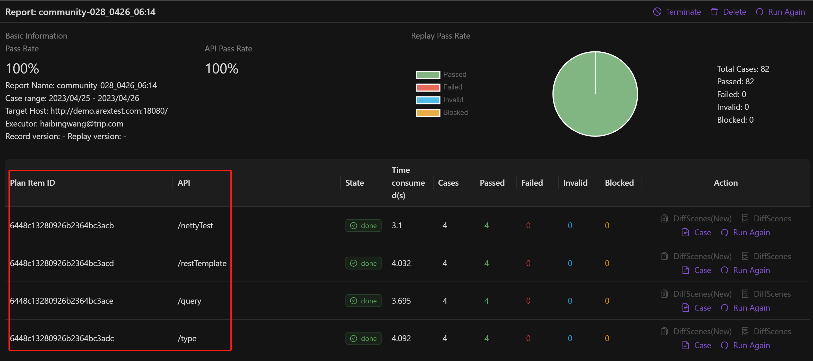

The principle of [AREX](https://github.com/arextest) is to inject a designated Java process via the AREX Agent, and record the request/response as well as the request/response from the process to the outside during recording. Then, based on the TransactionID, these information will be stored in the database.

As shown in the above, when AREX replays, it retrieves the request from the database and replays it, with the specific steps as follows:

1. The Schedule service sends a request to the service being tested, with the 'arex' included in the request header.
2. The tested service has loaded the Agent, and will call the corresponding code after receiving the request. The replayID will be stored in the call stack.
3. When the call chain accesses the MySQL database, the registered code will detect that it is in replay mode. At this point, the system will retrieve the previously recorded MySQL response data from the MongoDB database and return it to the function caller, instead of accessing the actual MySQL database.
4. The same approach also applies to Redis requests. In addition, new versions of requests will also be recorded in the database.

AREX uses MongoDB as its database system, and many of its functionalities and logics are related to data tables. For example, the registration of the application, as well as the recording of requests and responses, are all stored in data tables. Additionally, information such as replay plans, replay results, and intermediate data are also stored in data tables. Due to the complexity of AREX's call chains and data read/write operations, users may encounter some unexpected issues during usage, such as registration failures or unsuccessful recordings. In such cases, the simplest and most direct solution is to check the data tables in order to understand the cause of the problem.

So, this article has compiled some of the data tables of AREX and their meanings for students who want to use them more deeply, in order to reduce some learning costs.

Below are the collection names and their related descriptions in the MongoDB database for AREX version 0.2.8 and above.

| Collection Name        | Usage                                                         | Description                                                   | volume level |
| ----------------------------- | ------------------------------------------------------------ | ------------------------------------------------------------ | -------- |
| App                           | Used to store the applications registered by AREX Agent.                             | `appid` is the field displayed on the UI, and the field `appName` is not used and can be ignored. Checking skill: if a certain application is not displayed correctly on the UI, it can be queried in this table. | 10+      |
| CaseSummary                   | Used to store the cases of aggregating based on the classification of comparison differences.                          | Used as an intermediate table for intelligent analysis of comparison results. The comparison differences are divided into major and minor categories, where major categories represent broader differences, while minor categories are more specific differences under major categories. | 20,000+  |
| ConfigComparisonDecompression | Used to store the configuration of field compression types in comparison settings.                                 |                                                              |          |
| ConfigComparisonExclusions    | Used to store the ignored nodes in the comparison settings.                                         | If configured, the ignored nodes will be skipped during the replay comparison. These nodes include data such as timestamps, random numbers, IPs, etc., which do not have significant impact on the comparison results. |          |
| ConfigComparisonInclusions    | Used to store the nodes to be compared in the comparison settings.                                         | 
If configured, it represents that only the nodes in the table will be compared during the comparison. This function is opposite to ConfigComparisonExclusions. However, this table is not currently being used. |          |
| ConfigComparisonListSort      |  Used to store the fields used for sorting arrays during comparison in the comparison settings.                                     |                                                              |          |
| ConfigComparisonReference     | Used to store the reference relationship between nodes in the comparison settings.                              |                                                              |          |
| DynamicClass                  | Used to store the configuration for dynamic class.                                               | The dynamic class configuration in the user interface is obtained from this table. |          |
| Environment                   | Environment variable configuration table                                               | Table of configured environment variables                                              |          |
| FSFolder                      | **Collection**——Folder table                                | A table of folders under a collection, similar to subsets in Postman.  |          |
| FSInterface                   | **Collection**——Interface request table                               | A table of API requests under a collection/folder.         |          |
| FSCase                        | **Collection**——Case table                                     | The test case table under the interface request (FSCase is a sub-level of FSInterface), and the add field stores the HTTP method and URL of the test case.  |          |
| FSTraceLog                    | **Collection** logs of additions, deletions, and changes                            | This table is used to recover a Collection in case of accidental deletion or other mistakes during interface testing.              |          |
| FSTree                        | Collection tree structure table, used with FSFolder, FSInterface, FSCase |                                                              |          |
| Instances                     | List of services with the AREX Agent installed.                                        | The agent reports the machine status every 2 minutes, and the record has a TTL index of 3 minutes and will be deleted automatically when it times out. Checking technique: check for the currently active tested services (including the agent and have been started). |          |
| Label                         | **Collection**——Configuration Table of Lable                               | Labels set for test cases.      |          |
| MessagePreprocess             | Pre-processing table                                                     |                                                              |          |
| PreprocessConfig              | Pre-processing configuration table                                                 |                                                              |          |
| RecordServiceConfig           | Service recording configuration table                                               |                                                              |          |
| ReplayCompareResult           | Table that records the comparison details of each test case (including external calls) | The columns baseMsg is compressed with zstd and need to be decompressed to view the plaintext. This table is used to view the comparison results of a test case.  | 400,000+ |
| ReplayPlan                    | Replay Report——Plan Table (generated by the Schedule service)                    | `appid` is the name of the application as seen in the front-end page  | 700+     |
| ReplayPlanItem                | Replay Report - Interface Table                                             | A list of all the accessed interfaces in the replay report, generated by the Schedule service.  | 13,000+  |
| ReplayRunDetails              | Replay Details                                                   | Generated by the Schedule service, with partial duplication in ReplayCompareResult.    | 212,000+ |
| ReplayScheduleConfig          | Application replay configuration table                                               |                                                              |          |
| ReportDiffAggStatistic        | Replay report——Differences statistics table                                      |                                                | 1900+    |
| ReportPlanItemStatistic       | Replay report——Interface Table                                             | Generated by the Report service                                           | 12,000+  |
| ReportPlanStatistic           | Replay report——Plan Table                                             | Generated by the Report service                                           |          |
| RollingConfigFileMocker       | Recorded case——Configuration table                                            | Configuration of recorded cases                                               |          |
| RollingDatabaseMocker         |  Recorded case——Database table                                        | Recorded data in Database format.                                      | 12,000+  |
| RollingDubboConsumerMocker    |  Recorded case——Dubbo Consumer table                                  | Recorded data in Dobbo Consumer format.                                |          |
| RollingDubboProviderMocker    |  Recorded case——Dubbo Provider table                                  |             Recorded data in Dobbo Provider format.                                                  |          |
| RollingDynamicClassMocker     |  Recorded case——Dynamic class table                                            |          Recorded data in Dynamic class format.                                                    | 28,000+  |
| RollingHttpClientMocker       |  Recorded case——Http Client table                                    |                 Recorded data in Http Client format.                                             |          |
| RollingRedisMocker            |  Recorded case——Redis table                                           |      Recorded data in Redis format.                                                        | 42,000+  |
| RollingServletMocker          | Recorded case——Servlet table                                         | Recorded data in Servlet format.                                                             | 21,000+  |
| PinnedDatabaseMocker          | Saved case——Database table                                        | Database format data saved from recorded cases, obtained from RollingDatabaseMocker after saving recorded test cases. |          |
| PinnedDynamicClassMocker      | Saved case——Dynamic Class table                                          | Dynamic Class format data saved from recorded cases.                                             |          |
| PinnedHttpClientMocker        | Saved case——Http Client table                                     |                                                              |          |
| PinnedRedisMocker             | Saved case——Redis table                                           |      Redis format data saved from recorded cases.                                                        |          |
| PinnedServletMocker           | Saved case——Servlet table                                         |                     Servlet format data saved from recorded cases.                                          |          |
| SceneInfo                     | Table of scenarios aggregated according to the classification of comparison differences                            |                                             |          |
| Service                       | Application Services Table                                                  | AREX creates a record for each application by default                            |          |
| ServiceOperation              | Interface table                                                       |                                                              |          |
| User                          | user table                                                       |                                                              |          |
| UserWorkspace                 | User-Workspace relationship table                                            |                                                              |          |
| logs                          | System log table                                                   |                                                              | 633,000+ |
