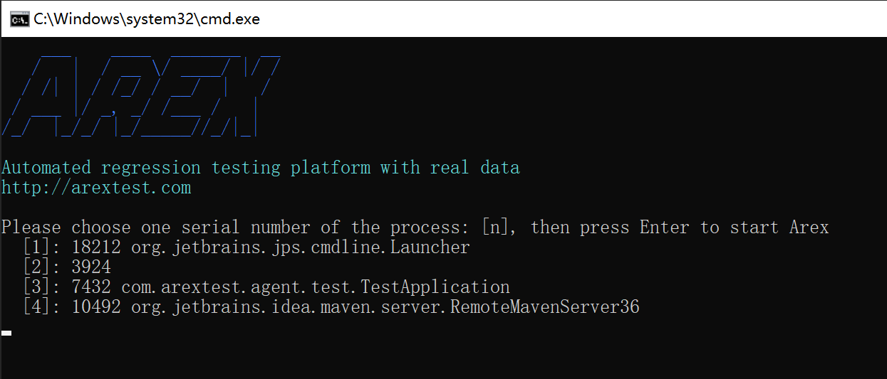
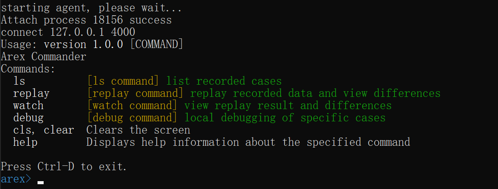
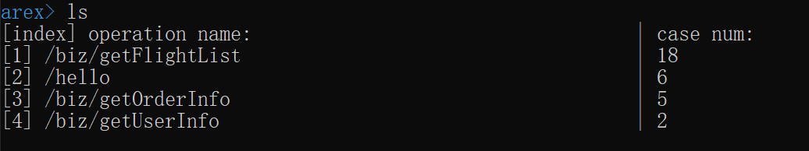
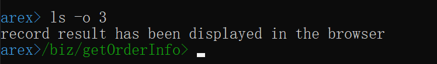
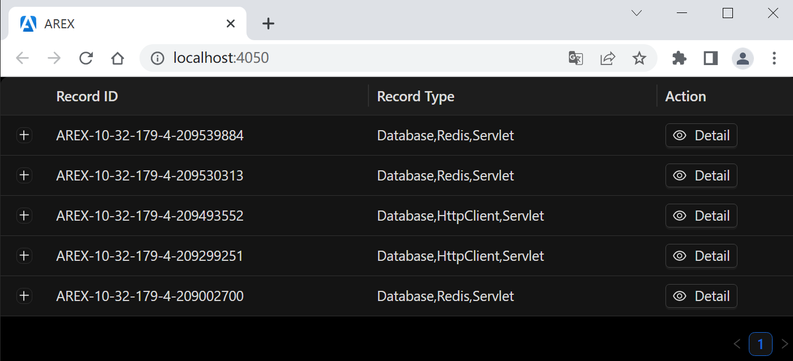
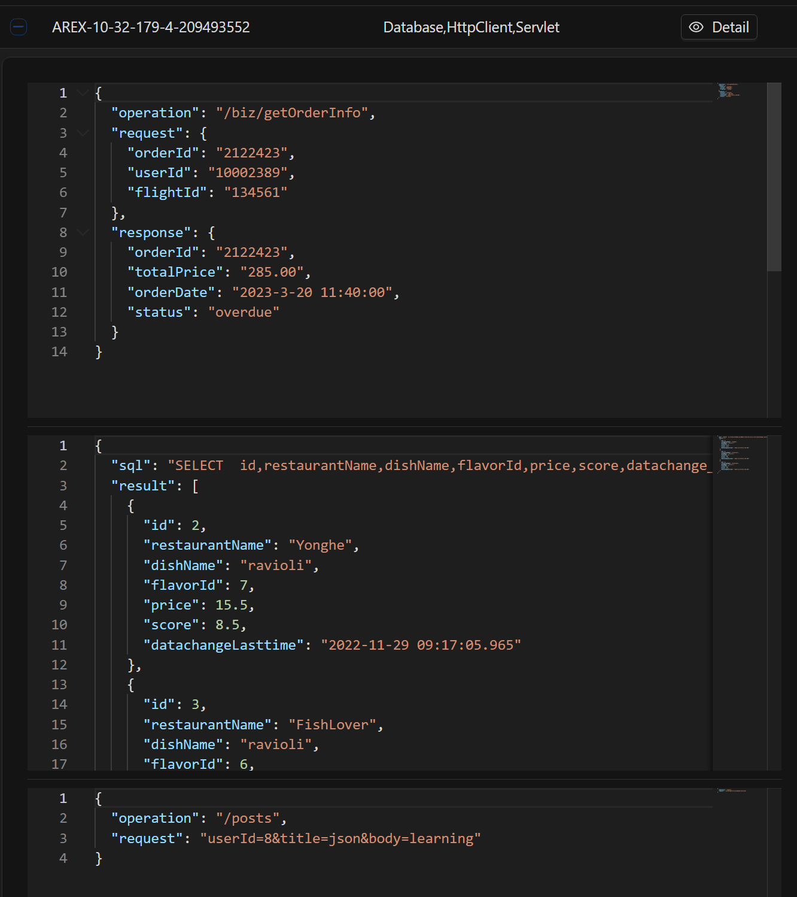
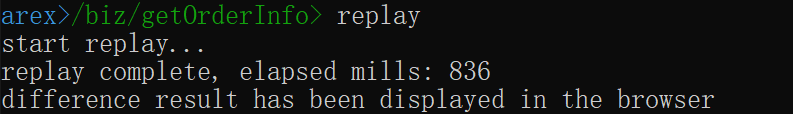
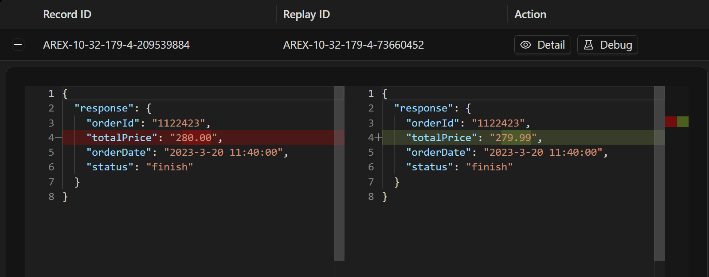

import { Callout } from 'fumadocs-ui/components/callout';

AREX [Standalone 模式](https://github.com/arextest/arex-standalone)指的是 AREX 在本地环境中独立运行，无需构建存储服务或其他服务组件。

使用 Standalone 模式的优势包括：

1. 独立性：可以在没有服务组件的情况下运行，这使得它更加独立和灵活。
2. 安全性：不需要依赖服务组
件，因此它可以更好地保护系统免受潜在的安全威胁。
3. 性能：可以更好地利用系统资源，因为它不需要与其他服务组件共享系统资源。
4. 易于部署：不需要依赖其他服务组件，因此可以更容易地部署和安装。

<Callout title="Tip">
本地命令行启动时，AREX Agent 会自动添加到应用程序中，无需在应用程序中配置 Agent 启动参数。
</Callout>

AREX Standalone 模式需要依赖 `arex-standalone` 项目来运行。该项目主要包括两个模块：

- **arex-cli** 

  命令行控制界面，通过该界面可以回放带有 [arex-agent-java](https://github.com/arextest/arex-agent-java) 的本地应用程序。

- **arex-local** 

  使用 [H2](https://www.h2database.com) 作为本地存储，保存记录数据和回放数据。

## 快速开始

### 1. 下载 arex-standalone-all.zip

从 [release](https://github.com/arextest/arex-standalone/releases) 页面上的 **Assets** 目录中下载 `arex-standalone-all.zip` 文件，并解压。

### 2. 执行脚本

- Windows 系统

  双击运行解压后的 `arex-standalone-all` 文件夹中的 **arex-cli.bat** 脚本文件。

- Mac/Linux 系统

  切换到 `arex-standalone-all` 文件夹并执行 `./arex-cli.sh`或 `sh ./arex-cli.sh` 脚本文件。

你也可以在 `arex-standalone-all` 文件夹中直接打开命令行/终端来执行以下命令：

```shell
java -jar arex-cli.jar
```

### 3. 选择进程 ID

在脚本启动成功后，进入如下的欢迎界面：



> 根据命令行中列出的 Java 进程，选择需要录制的应用，输入对应的数字 [n]，然后按 Enter 键继续。

比如你输入了数字 `3`（根据本地正在运行的应用），成功启动 AREX 后，将列出当前支持的命令：



> 如果使用 IntelliJ IDEA 或 Eclipse，AREX 启动时的日志将输出到控制台上，并显示 `ArexJavaAgent installed.` 的信息。

当前支持的命令如下：

- **ls** - 列出录制的数据（确保本地有流量请求进来，例如，你可以使用 Postman 先请求本地项目的接口，这样 AREX 才能记录下来）。

  `[option: -o/--operation]` 操作名称，如果录制了多个接口，可以指定接口来查看录制的情况，并在浏览器中显示结果（如果添加了此选项，则后续操作将基于当前接口）。

- **replay** - 回放录制的数据并查看差异。

  `[option: -n/--num]` 回放次数，默认为最近的 10 次。

- **watch** - 查看回放结果和差异。

- **debug** - 对特定的用例进行本地调试。

  `[option: -r/--recordId]` 录制 ID，必填选项。

## 命令行演示

### ls（列出命令）

执行 `ls` 命令： 



上图中显示了本地应用中录制的 4 个接口，以及每个接口被录制的次数。

<Callout title="Tip">
请确保有本地请求并被录制，控制台将输出 `[arex] save mover:` 的日志。
</Callout>

### ls -o/--operation

例如：执行 `ls -o 3` 命令来查看第 3 个接口 `/biz/getOrderInfo` 的录制数据。

<Callout title="Tip">
结果将在浏览器中显示，并且命令提示符将更新为当前正在执行的操作的名称，这样可以帮助你更好地了解正在进行的操作，并在需要时快速切换到其他操作。
</Callout>



这个页面将列出该接口下的所有录制数据和类型：



点击符号 `+` 或 `Detail` 按钮以查看具体的录制信息：



### replay（回放命令）

执行 `replay` 命令开始回放，回放成功后，将在浏览器中跳转结果：



展开以查看差异详情：



回放的原理是使用录制的数据请求您本地应用的 API。

<Callout title="Tip">
如果你本地应用的端口不是 `8080`，则可以添加 `-p` 选项来指定端口，例如：`replay -p 8081`。
</Callout>

同样，你也可以点击 `Debug` 按钮来回放单个用例。

## 常见问题

1. IntelliJ IDEA 在 Debug 模式下会影响 arex-agent-java（**2021年及以下版本**），因此可以取消勾选：File -> Settings -> Build, Execution, Deployment -> Debugger -> Async Stack Traces -> instrumenting agent，或者升级 IDEA 版本。具体原因请参考 [https://github.com/JetBrains/intellij-community/pull/1528](https://github.com/JetBrains/intellij-community/pull/1528)。

2. 如果你的 JDK 版本是 1.8，请确保你的计算机的 `/jdk/lib/` 目录下存在 **tools.jar**，代理启动需要依赖此 jar 包。

3. 本地记录的数据存储在操作系统的当前用户中：`~/arexdb.mv.db`，你可以删除此目录中的数据以清除本地数据。
