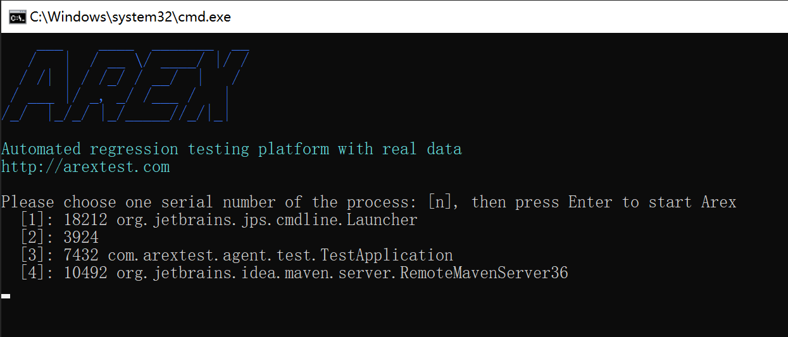
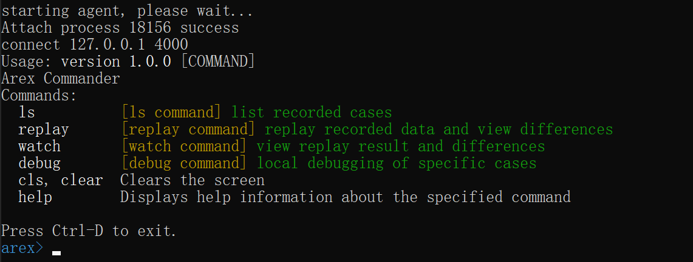
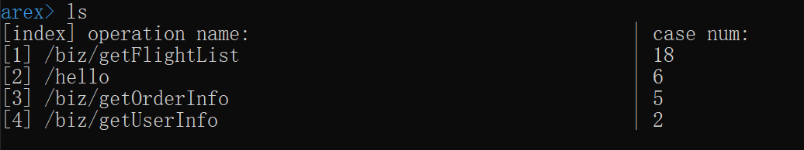
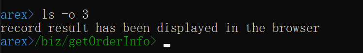
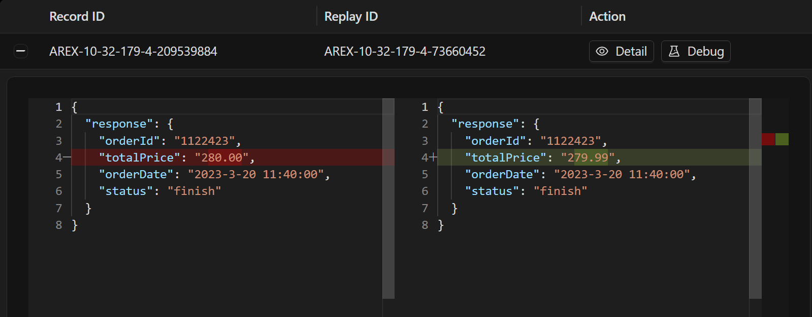

import { Callout } from 'fumadocs-ui/components/callout';

AREX [Standalone mode](https://github.com/arextest/arex-standalone) refers to the independent operation of AREX in a local environment without the need to build storage services or other service components.

The advantages of using Standalone mode include: 

1. Independence: it can run without service components, making it more independent and flexible. 
2. Security: it does not rely on service components, so it can better protect the system from potential security threats. 
3. Performance: it can better utilize system resources because it does not need to share system resources with other service components. 
4. Easy deployment: it does not rely on other service components, so it can be more easily deployed and installed. 

<Callout title="Tip">
When starting from the local command line, the AREX Agent will be automatically added to the application without the need to configure Agent startup parameters in the application.
</Callout>

AREX Standalone mode requires dependency on the `arex-standalone` project to run. This project mainly includes two modules:

- **arex-cli** 

  Command line control interface, through which the local application with [arex-agent-java](https://github.com/arextest/arex-agent-java) attached can be replayed.

- **arex-local** 

  Uses [H2](https://www.h2database.com) as a local storage to save the record data and replay data.

## Getting Started

### 1. Download arex-standalone-all.zip

Download the `arex-standalone-all.zip` file from the **Assets** directory on the 
[releases](https://github.com/arextest/arex-standalone/releases) page and decompress.

### 2. Execute script

- windows

  Double click to run **arex-cli.bat** files in the arex-standalone-all folder

- mac/linux

  Switch to the arex-standalone-all folder and execute `./arex-cli.sh` or `sh ./arex-cli.sh`

You can also directly open the command line/terminal to execute the following commands (arex-standalone-all folder):

```shell
java -jar arex-cli.jar
```

### 3. Choose pid

After the script starts, enter the welcome screen:



> select the project you need to record based on the Java processes listed in the command line, 
> input [num] and press **Enter** to continue.

For example input `3` (based on the project running locally)

After successfully starting the AREX, the commands currently supported will be listed:



> If you use IntelliJ IDEA or Eclipse, the log of AREX startup will be output on the console:
`ArexJavaAgent installed.`

The supported commands are as follows:

- **ls**- list recorded data (ensure that there are traffic requests coming in locally, for example, 
you can use Postman to first request the interface of the local project, so that Arex can record it)

  `[option: -o/--operation]` operation name, if multiple interfaces are recorded, 
   the interface can be specified to view the recording case and results will be displayed in the browser
   (if this option is added, subsequent operations will be based on the current interface)

- **replay**- replay recorded data and view differences

  `[option: -n/--num]` replay numbers, default the latest 10

- **watch**- view replay result and differences

- **debug**- local debugging of specific cases

  `[option: -r/--recordId]` record id, required Option

## Command Demonstration

### ls



The above image shows a total of 4 interfaces for your local project recorded 
and the number of times each interface was recorded

<Callout title="Tip">
Ensure that there are requests coming in locally and recorded, the console will output the logs of `[arex] save mover:`
</Callout>

### ls -o/--operation

For example: `ls -o 3` view the recording data of the 3rd interface: /biz/getOrderInfo

<Callout title="Tip">
Results will be displayed in the browser and the command prompt is updated to the current operation name.
</Callout>



The page will list all recording data and types under this interface:


Click on the symbol `+` or `Detail` button to view the specific recording information:


### replay


Expand to see the difference details:



**the principle of replay is to request the API of your local project using recorded data**

<Callout title="Tip">
if the port of your local project is not 8080, you can add the `-p` option to specify the port, 
such as: `replay -p 8081`.
</Callout>

Similarly, you can also select the `Debug` button to play back a single case.

## Note

1. IntelliJ IDEA in debug mode will affect arex-agent-java (**below 2021 version**), 
   so you can remove the check mark from:
   File -> Settings -> Build, Execution, Deployment -> Debugger -> Async Stack Traces -> instrumenting agent, 
   or upgrade the idea version. specific reasons refer to
   [https://github.com/JetBrains/intellij-community/pull/1528](https://github.com/JetBrains/intellij-community/pull/1528)
2. If your JDK version is 1.8, ensure that **tools.jar** exists in your computer's `/jdk/lib/`, 
   agent startup needs to rely on this jar.
3. The locally recorded data is stored in the current user of the operating system: 
   `~/arexdb.mv.db`, you can delete the data in this directory to clear the local data.
