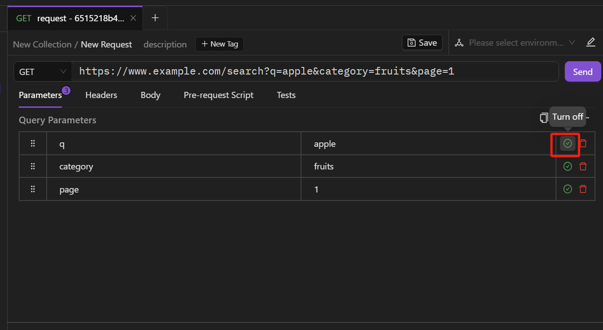
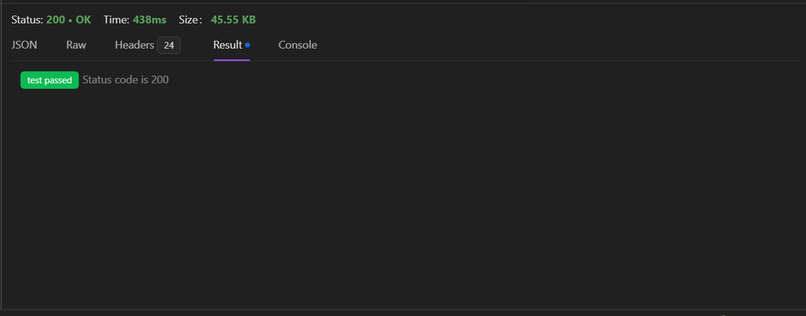

在开始使用之前，先介绍一下 AREX 中**集合**、**请求**、**测试用例**相关概念。

- 集合（Collection）：类似文件夹的概念，通常可以把同一个项目的多个请求放在一个集合里方便管理和分享。
- 请求（Request）：创建于集合之下。一个项目通常包含多个接口，可以为不同的接口创建对应的请求。
- 测试用例（Case）：创建于请求之下。实际测试中，同一个接口通常会有多种情况需要测试，比如参数正确、参数错误等等，可以将每种情况都保存为测试用例，后续可直接运行接口用例，无需再输入参数。

## 新建请求

点击集合右侧的下拉菜单新建一个请求：

打开新请求页面后，你可以添加接口请求所需的详细信息。

## 添加请求详细信息

### 添加请求地址

在地址栏中输入你要发送请求的接口地址。

### 选择请求方法

新建请求后，请求方法默认选择为 `GET`， `GET` 请求将从服务器获取信息。当然你也可以使用其他方法进行请求，具体如下：

- POST：添加新的数据
- PUT：替换现有数据
- DELETE：删除现有数据
- PATCH：更新现有数据

### 添加查询参数

**Query Parameters**即 URL 中 `? `后的参数，通过 & 分隔多个参数。你可以选择在 URL 字段中直接输入 Query Parameters，也可以在 **Parameters** 标签中手动添加。

要想添加 ***Query Parameters**，点击“**+**”图标新增 Qurey 参数，手动添加参数键值。

图标表示该参数正在使用，点击该图标可禁用。

点击图标可再次启用。

### 配置请求头

如你需要随请求发送特定的请求头信息，可以手动添加请求头键值对。

你可以点击 **action.record** 图标  来对当前请求进行强制录制，将其保存为测试用例。具体见 [强制录制](../chapter2/Forced%20Record.md).

### Body 参数

当你需要将数据从客户端发送给 API 时，则需要随请求发送请求体数据。通常在 `PUT` 、POST 和 `PATCH` 请求中会使用到请求体。

目前请求体仅提供 JSON 数据类型。

### 使用脚本

脚本分为**前置脚本**和**后置脚本**两种，分别对应 API **请求前**和**返回数据后**的两个阶段。

#### 前置脚本

点击 **Pre-request Script** 标签中 **Add Script Block**，为请求添加前置脚本。

界面右侧提供了常用的前置脚本，可直接点击使用。

#### 后置脚本

在此页面，你可以通过编写 Javascript 代码，在后置脚本中测试（断言）请求返回结果的正确性。右侧提供了多种常用后置脚本，可直接点击使用。

配置好请求参数后，点击发送即可获取响应。

## 返回响应

响应框的上方可以看到请求的状态码、请求时间和请求大小。

- **Response Body**

Response Body 是响应的正文，即从服务器返回的响应内容，内容的数据格式默认为 JSON。

Raw 视图可以查看原始的响应体内容。

- **Headers**

Headers 可以看到响应头信息。

- **Result**

如果你设置了后置脚本，则可以在 Results 中查看执行脚本的结果。

- **Console**

Console 用于显示请求和响应的日志信息。它可以用来查看请求的详细信息，包括请求头、请求体、响应头和响应体等。Console 还可以显示请求期间发生的任何错误或警告。
