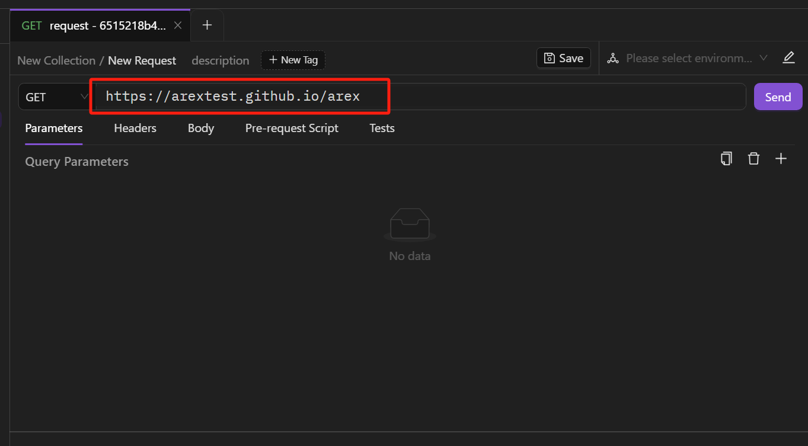

Before starting to use it, let’s introduce the concepts of collection, request, and test case in AREX.

- Collection: similar to the concept of a folder, multiple requests of the same project can be put into a collection for easy management and sharing.
- Request: created under the collection. A project usually contains multiple interfaces, and corresponding requests can be created for different interfaces.
- Test case: created under the request. In API testing, the same interface usually needs to be tested in multiple scenarios, with correct parameters, incorrect parameters, etc. Each scenario can be saved as a test case, and the interface cases can be directly run without re-entering the parameters.

## Creating new requests

You can create a new request by selecting **Add Request** in the dropdown list of the collection to open a new tab.

After opening the new tab, you can add the details you need for your request.

## Adding request details

### Setting request URLs

Each request you send requires a URL representing the API endpoint you are working with. The URL will typically be the base location plus path. For example, in the request `https://arextest.github.io/website`, `https://arextest.github.io` is the base URL, and `/website` is the endpoint path.

Enter the URL for the request into the URL field.

### Selecting request methods

The default method for a new request is set as `GET`，which means retrieving data from an API. You can also use a variety of other methods. The most common options include:

- POST — add new data
- PUT — replace existing data
- PATCH — update some existing data fields
- DELETE — delete existing data

### Setting parameters

You can send query parameters with your requests in the URL field or the **Parameters** tab. **Query parameters** are appended to the end of the request URL, following ? and listed in key value pairs, separated by & using the following syntax: `?id=1&type=new`.

To send a query parameter, you can add it directly to the URL or open **Parameters** tab and click "**+**" to enter the key value pair.

The  icon indicates that the parameter is in use, and you can click the icon to disable it. Select  to re-enable.

### Configuring request headers

Some APIs require specific headers to be included in requests, usually to provide additional information about the operation being performed. These headers can be configured in the **Headers** tab. Simply enter the necessary key-value pairs, and AREX will include them in the request.

You can select the **action.record** icon  before sending the request to record it as a test case forcedly. See the details in [**Forced Record**](../chapter2/Forced%20Record.md).

### Sending body data

When you need to add or update structured data, body data must be included in requests. This is typically done with `PUT`, `POST`, and `PATCH` requests.

You can specify a JSON data in the **Body** tab to send with your request.

### Writing scripts

You can add JavaScript code to run before sending a request or after receiving a response with:

- Pre-request script in the **Pre-request Script** tab.
- Test script in the **Tests** tab.

#### Pre-request Script

To include code you want to execute before sending a request, select the **Pre-request Script** tab → **Add Script Block** and enter the JavaScript you need to process before the request runs, then select Save.

The interface provides commonly used pre-request scripts that can be used directly by clicking on the right side.

#### Tests

Tests confirm that your API is working as expected. In the **Tests** tab, you can test the correctness of the request response results by writing test scripts in JavaScript. This can also help in debugging when something goes wrong with your API project. You can, for instance, write a test to validate your API's error handling by sending a request with missing information or incorrect parameters.

The page provides various commonly used post-request scripts that can be used directly by clicking on them.

After configuring the request parameters, click **Send** to get the response.

## Receiving responses

The response viewer displays the status code, request time, and size of the request body at the top.

- **Response Body**

The Response Body is the content of the response, which is the data returned from the server. The default data format is JSON.

The **Raw** view displays the raw response body as a large text area, allowing you to see if the response is minified.

- **Headers**

Headers are displayed as key-value pairs under the **Headers** tab. 

- **Result**

The test results for the API request can be found in the **Result** tab, if any test scripts were run.

- **Console**

The "Console" is used to display log information for requests and responses. It can be used to view detailed information about the request, including request headers, request body, response headers, and response body. The Console can also display any errors or warnings that occur during the request.
