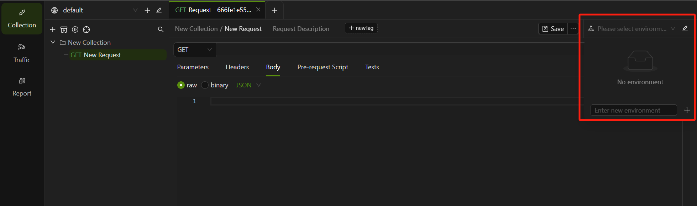
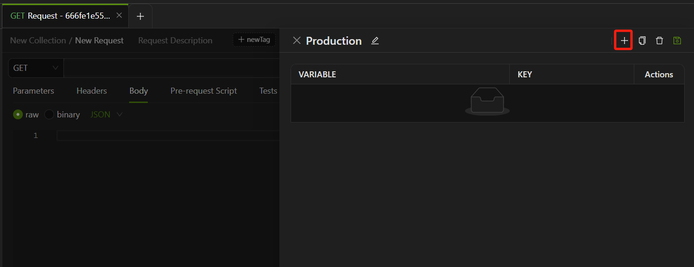
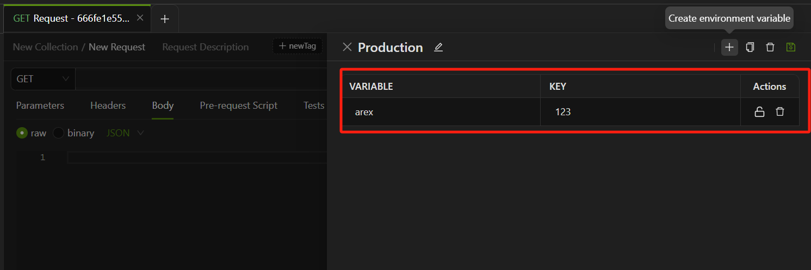
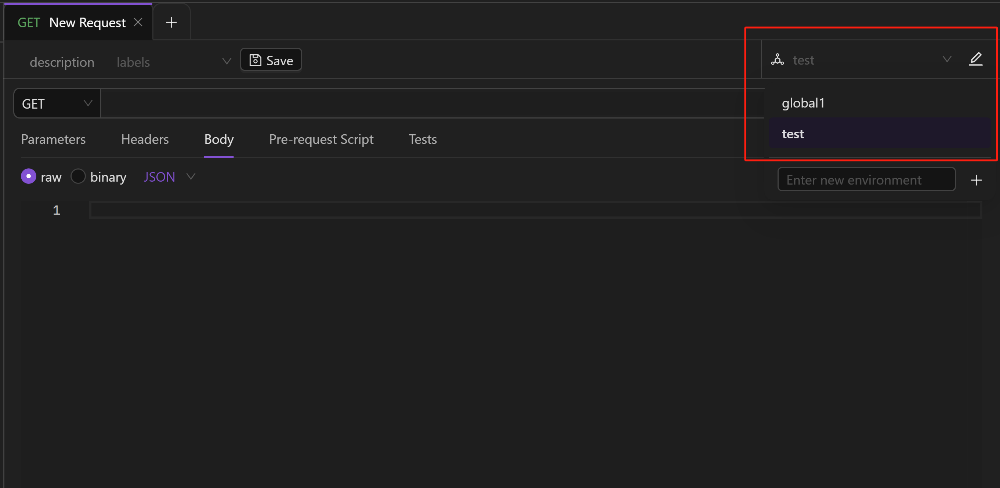

一个项目在不同的阶段会处于不同的环境中，比如开发环境、测试环境、生产环境，通常不同的环境有不同的前置 URL、接口参数值等。因环境不同而频繁的更改接口前置 URL 及参数，是非常的麻烦的。可以在 AREX 中创建不同的环境，并且在每个环境中设置不同的环境变量，在不同环境中测试时，直接切换环境即可。

## 新建环境

前往 **Collection -> Request**，在接口请求页面右上角创建新环境。



在 **“Enter new environment“** 框中输入环境名，点击 **“+”** 完成创建。

环境创建完成后：

- **“+”**： 添加环境变量。
- ""：对该环境进行重命名。
- ""：复制该环境。



### 添加环境变量

环境变量是跟随环境切换而发生改变的变量。

点击“**+**”图标添加环境变量，**VARIABLE** 中输入变量名称，**KEY** 中输入变量值。并点击图标进行保存。



另外，你也可以通过编写前置脚本在当前环境设置新的环境变量，例：

```
arex.environment.set("variable_key", "variable_value");
```

设置成功后，使用环境变量时需要加上双大括号，如`{{VARIABLE}}`，实际运行时系统会自动将其替换为设置的变量值。

## 访问环境

你可以通过请求中的 URL、参数、请求体、前置脚本及后置脚本等访问你的环境变量。

### 选择环境

如果需要使用某个环境中的环境变量，可以点击右上角的环境切换按钮进行选择。



选中你需要的环境，AREX 会将设定为当前环境，随后你可以在请求中引用该环境中的环境变量，利用该环境变量的值执行所有请求。

要在请求中使用一个环境变量，只需引用该环境名，并用双大括号包围，如：`{{variable}}。`。在实际执行过程中，系统会自动将其替换为之前设定好的值。

你可以在请求的 URL、参数、Headers、和请求体中使用相同的变量。将鼠标移到引用的变量之上，即可查看其值。


### 通过脚本编辑环境变量

你也可以通过前置脚本和后置脚本编辑环境变量的值。

使用 `pm.environment` 在当前选定的环境中设置一个环境变量：

```
pm.environment.set("variable_key", "variable_value");
```

如果你通过在请求中写脚本为环境变量赋值，将适用于所有引用这些变量的请求。
