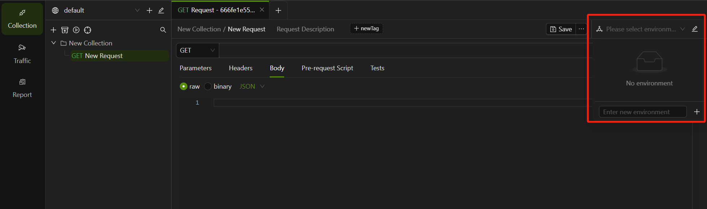
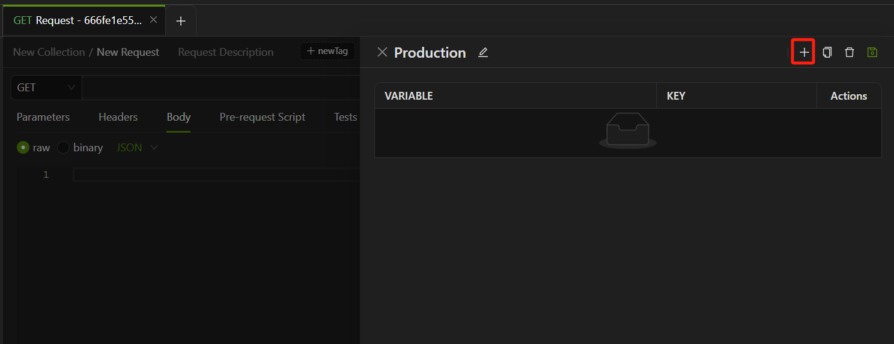
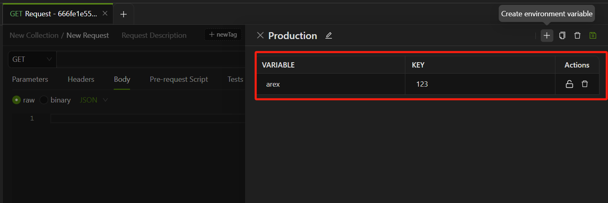
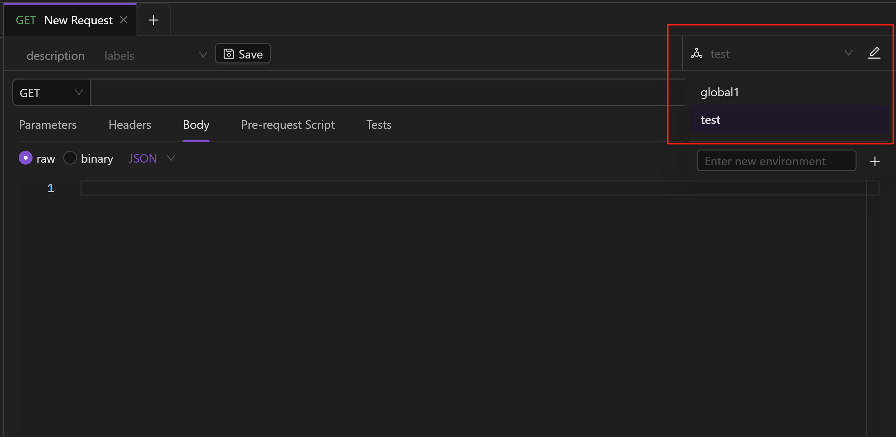

A project will be in different environments at different stages, such as development environment, test environment, and production environment. Usually, different environments have different pre-fixed URLs and different parameter values for the interfaces. Changing the pre-fixed URL and parameters frequently due to different environments is very inconvenient. Different environments can be created in AREX and different environment variables can be set in each environment. When testing in different environments, you can simply switch environments.

## Creating environments

Go to **Collection ——> Request**, create a new environment in the upper right corner of the interface request you want to work with.



**Enter new environment name** in the input box and click **"+"** to creat.

Once the environment is created: 

- **+**: add environment variables.
- : rename the environment.
- ：duplicate the environment.



### Adding environment variables

Environment variables are variables that change in response to environment switches. You can add variables to an active (currently selected) environment by opening the environment from the sidebar and editing it in the tab that opens.

Enter the name in **VARIABLE** and values in **VALUE** for a new variable on a new line. Then select the  icon to save your changes.



You can also update environment variable value via Pre-request and Tests scripts .

Use arex.environment to set an environment variable in the active (currently selected) environment:

```
arex.environment.set("variable_key", "variable_value");
```

Mind that if you write scripts to assign values to environment variables, all requests that refer to these variables will reflect the updates.

## Accessing environments

You can access your environment variables from your request elements, including the URL, parameters, body data, and test scripts.

### Selecting an active environment

To use the variables in an environment, select it from the environment selector at the right corner of the workbench.


