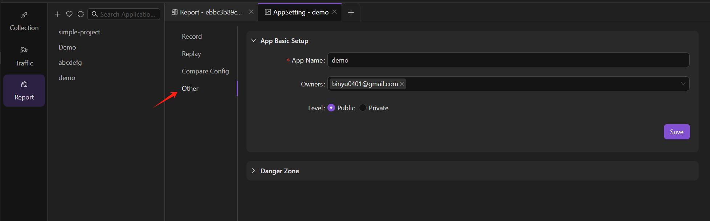

The user who creates the application is the Owner of that application and has all operational permissions. Regular users can only start replays, view replay reports, etc.

|    | Owner Permissions | Regular User Permissions |
| ---------------- | -------- | -------- |
| Modify Configuration | √        | ×        |
| Start Replay         | √        | √        |
| View Replay Statistics | √        | √        |
| Delete Application   | √        | ×        |
| View Recording Details (Pre-Desensitization Data) | √        | ×        |
| Add Other Members as Owner | √        | ×        |

Go to **Report -> AppSetting -> Other** for settings, where the Owner can add organizational members to become Owners.

