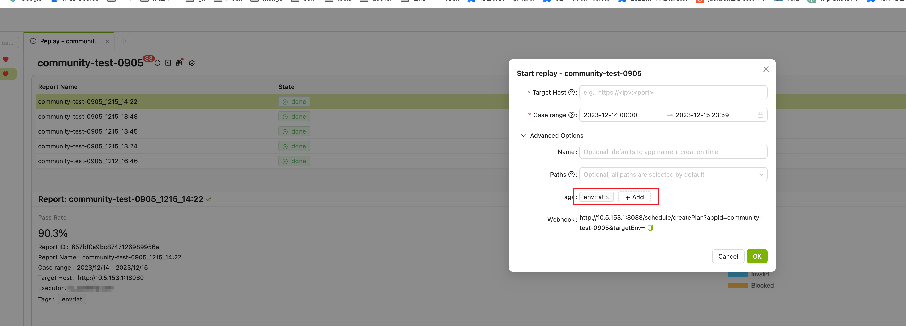

## 应用创建流程

### 步骤一：新建应用

点击 **Traffic** 进入录制页面，点击菜单栏左上角 **”+“** 新建一个应用，并输入应用名称。


在成功创建新的应用后，如下所示，将自动生成 Agent 的启动参数和 Agent 下载链接，点击下载最新版本 AREX Agent Java。


即：

```
java -javaagent:</path/to/arex-agent.jar> -Darex.service.name=1a2caf7394756ca3  -Darex.storage.service.host=arex-storage-alb-1475960894.us-west-2.elb.amazonaws.com -Darex.api.token=trip:712Vqq3/oa72aOrroBUsDYYrM+OQWQmqg4GAMHOWYhkCmswuWtIlP0CMhfKCPz6NypTloF4o9OTFlhTVRlLXmw== -jar <your-application.jar>
```

- `</path/to/arex-agent.jar>`：arex-agent.jar 是 AREX Agent JAR 包名称，`/path/to/arex-agent.jar` 需要替换为实际存放 AREX Agent JAR 文件的目录路径。
- `<your-application.jar>`：请修改 `your-application` 为需要录制的服务名称。
- **如需查看 Agent 的日志，请加上 debug 参数： -Darex.enable.debug=true**
- 如果遇到 AREX Agent与其他 Agent（例如OpenTelemetry Agent）发生冲突时，可以通过在启动参数中添加特定的参数来解决这一问题：
    ```
    -Darex.ignore.type.prefixes=io.opentelemetry
    -Darex.ignore.classloader.prefixes=io.opentelemetry
    ```
    如果存在其他 Agent 的冲突，可以使用逗号（,）将多个前缀添加到相应的参数中：
    ```
    -Darex.ignore.type.prefixes=io.opentelemetry,other.agent.prefix
    -Darex.ignore.classloader.prefixes=io.opentelemetry,other.agent.prefix
    ```

请根据情况自行修改 **“< >”** 内的参数，之后需要将该 Agent 参数粘贴到你所需要录制的服务中启动应用。

### 步骤二：流量环境区分

在 AREX 中，支持在录制流量时根据不同的环境为流量设置不同的环境标签，这是为了帮助用户根据标签对录制的流量进行灵活的筛选和回放，以满足特定环境或需求的测试场景。例如，用户可以根据不同的环境标签来选择相应的流量进行回放，以验证系统在不同环境下的性能和稳定性。

使用时需要在 Agent 启动参数中添加参数：`-Darex.tags.env=<xxx>`，添加后，录制到的流量都会自动添加上 `env:<xxx>` 的标签。

在随后进行回放测试时，可以根据不同的环境标签进行回放：



### 步骤三：部署 Agent 启动应用

你可以选择以下任意一种方式为你的应用部署 Agent：

#### 配置 Java 参数运行模式

粘贴刚才生成的 Agent 的启动参数并运行，启动 Agent 运行应用：

```shell
java -javaagent:</path/to/arex-agent.jar> -Darex.service.name=1a2caf7394756ca3  -Darex.storage.service.host=arex-storage-alb-1475960894.us-west-2.elb.amazonaws.com -Darex.api.token=trip:712Vqq3/oa72aOrroBUsDYYrM+OQWQmqg4GAMHOWYhkCmswuWtIlP0CMhfKCPz6NypTloF4o9OTFlhTVRlLXmw== -jar <your-application.jar>
```

#### 配置文件运行模式

你也可以通过新建一个名为：arex.agent 的 conf 配置文件来进行配置，其中内容为：

```conf title="arex.agent.conf"
arex.service.name=your-service-name  
arex.storage.service.host=arex-storage-alb-1475960894.us-west-2.elb.amazonaws.com
```

然后运行如下命令完成配置：

```shell
java -javaagent:</path/to/arex-agent.jar> -Darex.config.path=/path/to/arex.agent.conf -jar your-application.jar
```

#### 修改 JAVA_OPTS 运行模式

你可以通过运行 Tomcat，配置 `catalina.sh` 文件并修改 `JAVA_OPTS` 变量来部署 AREX Agent，也可以直接在环境变量中配置，以 Linux 运行为例：

```shell
export AREX_STORAGE_SERVICE_HOST=arex-storage-alb-1475960894.us-west-2.elb.amazonaws.com
export AREX_API_TOKEN=trip:712Vqq3/oa72aOrroBUsDYYrM+OQWQmqg4GAMHOWYhkCmswuWtIlP0CMhfKCPz6NypTloF4o9OTFlhTVRlLXmw==
export JAVA_TOOL_OPTIONS=&quot;-javaagent:&lt;AREX Agent JAR DIR&gt;/arex/arex-agent.jar -Darex.service.name=1a2caf7394756ca3 -Darex.storage.service.host=$AREX_STORAGE_SERVICE_HOST -Darex.api.token=$AREX_API_TOKEN&quot;
```

之后你可以正常运行 Tomcat。AREX Agent 将被自动注入 JVM 中，并在 Tomcat 启动时运行。

默认情况下，AREX 将自动录制所有时间段内的线上真实请求流量。你也可以通过录制回放设置，根据自己的需要设定录制任务。

## 查看录制详情

应用录制到请求后，前往 **Traffic** 点击相应应用名称，查看录制的用例列表。录制到的用例会根据接口路径进行分组。点击展开某个接口路径，即可查看该路径下所有录制的用例详情。


点击用例 Record ID，查看该用例详情。


一个完整的录制用例应包含以下部分：

- **Servlet**：主接口的请求和响应报文。
- **DynamicClass**：如存在动态类调用，则展示请求和响应报文。
- **Database、Redis**：如果存在第三方依赖如 Redis 和 DB 的调用，则展示请求和响应报文。

默认只保存 4 天内的录制用例，超期后用例会被自动删除。
