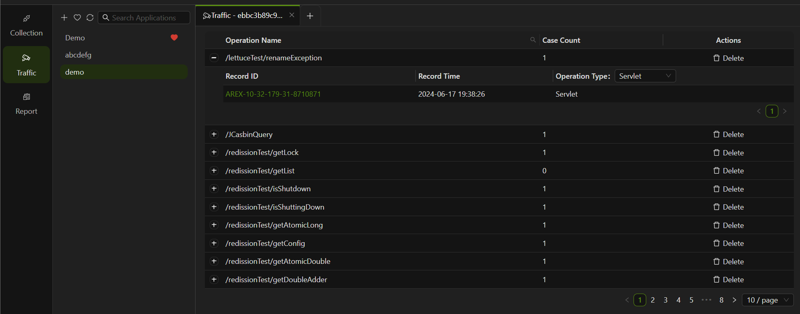

### Step 1: Create application

1. Go to **Traffic** and click **"+"** in the top left corner to create a new application. Enter the application name.


2. After successfully creating a new application, as shown below, the startup parameters for the Agent and the download link for the Agent will be automatically generated. Click to download the latest version of AREX Agent Java.


The parameters:

```
java - javaagent:</path/to/arex-agent.jar> -Darex.service.name=1a2caf7394756ca3  -Darex.storage.service.host=arex-storage-alb-1475960894.us-west-2.elb.amazonaws.com -Darex.api.token=trip:712Vqq3/oa72aOrroBUsDYYrM+OQWQmqg4GAMHOWYhkCmswuWtIlP0CMhfKCPz6NypTloF4o9OTFlhTVRlLXmw== -jar <your-application.jar>
```

- `</path/to/arex-agent.jar>`: `arex-agent.jar` is the name of the AREX Agent JAR package. Replace `</path/to/arex-agent.jar>` with the actual directory path where the AREX Agent JAR file is stored.
- `<your-application.jar>`: Please modify `your-application` to the name of the service you want to record.
- If you encounter conflicts between the AREX Agent and other agents (such as the OpenTelemetry Agent), you can resolve this issue by adding specific parameters to the startup arguments:
  ```
  -Darex.ignore.type.prefixes=io.opentelemetry
  -Darex.ignore.classloader.prefixes=io.opentelemetry
    ```
In the event of conflicts with other agents, you can add multiple prefixes to the corresponding parameters separated by a comma (,):
  ```
  -Darex.ignore.type.prefixes=io.opentelemetry,other.agent.prefix
  -Darex.ignore.classloader.prefixes=io.opentelemetry,other.agent.prefix
    ```
- **To view the Agent's logs, add the debug parameter: `-Darex.enable.debug=true`**


Please modify the parameters within the **"< >"** according to the situation, and then you need to paste the Agent parameters into the service where you want to start recording the application.

### Step2: Segmenting Traffic based on varying environments

In AREX, you can add different environment labels for the recorded traffic. This is to help users flexibly filter and replay  traffic according to the labels to meet the test scenarios of specific environments or requirements. For example, users can select the corresponding traffic for replay based on different environment labels to verify the performance and stability of the system in different environments.

To do this, you need to add the parameter: `-Darex.tags.env=<xxx>` to the Agent startup parameters, after which the recorded traffic will be automatically tagged with `env:<xxx>`.

### Step 3: Deploy AREX Agent

The AREX Agent can be deployed using various methods, including:

#### Configure Java Parameters

Paste the startup parameters of the Agent you just generated and run it to start the Agent to run the application:

```shell
java -javaagent:</path/to/arex-agent.jar> -Darex.service.name=1a2caf7394756ca3  -Darex.storage.service.host=arex-storage-alb-1475960894.us-west-2.elb.amazonaws.com -Darex.api.token=trip:712Vqq3/oa72aOrroBUsDYYrM+OQWQmqg4GAMHOWYhkCmswuWtIlP0CMhfKCPz6NypTloF4o9OTFlhTVRlLXmw== -jar <your-application.jar>
```

#### Deployment Configuration File

You can create a new configuration file `arex.agent.conf` as shown below:

```conf title="arex.agent.conf"
arex.service.name=your-service-name  
arex.storage.service.host=arex-storage-alb-1475960894.us-west-2.elb.amazonaws.com
```

Then configure Agent:

```shell
java -javaagent:</path/to/arex-agent.jar> -Darex.config.path=/path/to/arex.agent.conf -jar your-application.jar
```

#### Set the Java options by using the JAVA_OPTS environment variable

You can deploy the AREX Agent on Tomcat by configuring the `catalina.sh` file or setting the `JAVA_OPTS` environment variable directly. Here’s an example of how to do this on Linux:

```shell
export AREX_STORAGE_SERVICE_HOST=arex-storage-alb-1475960894.us-west-2.elb.amazonaws.com
export AREX_API_TOKEN=trip:712Vqq3/oa72aOrroBUsDYYrM+OQWQmqg4GAMHOWYhkCmswuWtIlP0CMhfKCPz6NypTloF4o9OTFlhTVRlLXmw==
export JAVA_TOOL_OPTIONS=&quot;-javaagent:&lt;AREX Agent JAR DIR&gt;/arex/arex-agent.jar -Darex.service.name=1a2caf7394756ca3 -Darex.storage.service.host=$AREX_STORAGE_SERVICE_HOST -Darex.api.token=$AREX_API_TOKEN&quot;
```

You can then run Tomcat as usual. The AREX Agent will be automatically injected into the JVM and run when Tomcat starts.

Once configured, AREX will automatically records all online traffic by default.

## View recording details

After recording the real requests to your application, navigate to the **Traffic** section and click on the corresponding application to view the list of recordings. The recorded test cases are grouped by the API path. Expand the API path to see all the test cases recorded under that path



Click on the Test Case Record ID to view the details of that test case.


A complete recorded test case should include the following parts:

- **Servlet**: The request and response messages of the main interface.
- **DynamicClass**: If there are dynamic class invocations, their request and response messages are displayed.
- **Database, Redis**: If there are third-party dependencies such as Redis and DB calls, their request and response messages are also presented."

By default, only recording test cases from the past 4 days are saved, and cases beyond this period will be automatically deleted.
