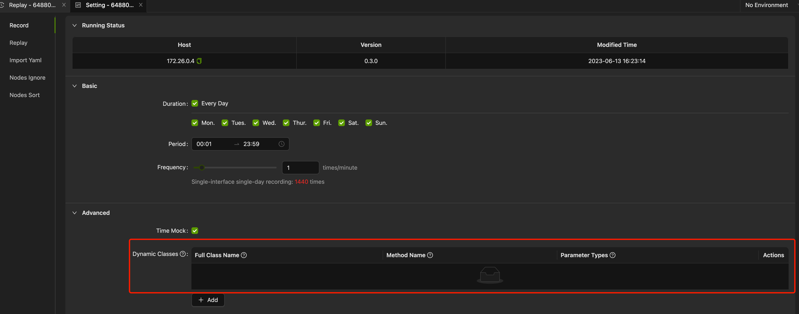

The AREX has a very powerful mock mechanism, supporting automatic data collection and mocking for various mainstream technology frameworks. It also supports capturing and mocking local time, cache data, and various in-memory data.

In real applications, various types of local cache data are often utilized to improve runtime performance. However, during the recording and replay process, this type of data can be influenced by external factors, potentially leading to inconsistencies and failures of replay, thereby increasing the difficulty of troubleshooting.

In such scenarios, you can proactively configure the dynamic class mechanism in AREX to achieve data collection and mocking for this type of data. Specifically, you can configure this setting in the **Setting → Record → Advanced** configuration page.



In the highlighted area of the diagram, you can configure the **Full Class Name**, **Method Name** (optional, if not configured, it will be applied to all public methods with parameters and return values), and **Parameter Types** (optional) in sequence. Once the configuration is complete, the `arex-agent` will automatically inject code similar to the Record&Replay code into the corresponding methods, enabling data collection and mocking during the replay process.

The following provides a brief explanation from a code implementation perspective on how AREX achieves automatic mocking of data during traffic replay, to facilitate understanding of how to configure dynamic classes in the recording configuration.

## The principle of traffic recording and replay

Let's start with a simple function as an example to understand how to record and replay. Suppose we have the following function that converts a given IP string to an integer value. Here's the code:

```java
public Integer parseIp(String ip) {
    int result = 0;
    if (checkFormat(ip)) { // Check whether IP address is legal
        String[] ipArray = ip.split("\\.");
        for (int i = 0; i < ipArray.length; i++) {
            result = result << 8;
            result += Integer.parseInt(ipArray[i]);
        }
    }
    return result;
}
```

Now I will illustrate how to implement the traffic replay feature of this function from two sides:

### Record (traffic collection)

When this function is called, we save the corresponding request parameters and the return result for later use in traffic replay. Here's the code:

```
if (needRecord()) {
    // Data collection, saving parameters and execution results into DB
    DataService.save("parseIp", ip, result);
}
```

### Replay (traffic replay)

During traffic replay, we can use the previously collected data to automatically mock this function. Here's the code:

```java
if (needReplay()) {
    return DataService.query("parseIp", ip);
}
```

By examining the complete code, we can better understand the logic of its implementation:

```java
public Integer parseIp(String ip) {
    if (needReplay()) {
        // replay scenes, use the collected data as the return result, which is essentially mock.
        return DataService.query("parseIp", ip);
    }
 
    int result = 0;
    if (checkFormat(ip)) {
        String[] ipArray = ip.split("\\.");
        for (int i = 0; i < ipArray.length; i++) {
            result = result << 8;
            result += Integer.parseInt(ipArray[i]);
        }
    }
 
    if (needRecord()) {
        // Recorded scenes, save the parameters and results to the database
        DataService.save("pareseIp", ip, result);
    }
    return result;
}
```

## Implementation in AREX

The principle behind AREX is similar, but it is more complex and doesn't require developers to manually add recording and replay code to their business logic. The `arex-agent` automatically adds the necessary code in the relevant code blocks during application startup to implement this functionality. Let's take MyBatis3's Query as an example to explore the specific implementation in AREX.

Those who have read the MyBatis source code should be familiar with the fact that Query operations are mainly performed in the `query` method of the `org.apache.ibatis.executor.BaseExecutor` class (excluding Batch operations). The method signature is as follows:

```
public <E> List<E> query(MappedStatement ms, Object parameter, RowBounds rowBounds, ResultHandler resultHandler, CacheKey key, BoundSql boundSql) throws SQLException
```

This method includes the executed SQL statement and its parameters, and the result of the function includes the data retrieved from the database. It is evident that performing data collection here is appropriate, and during replay, we can use the collected data as the returned result, thus avoiding actual database operations. Let's take a look at the code in AREX. For the sake of simplicity and better understanding, some simplifications have been made, as shown below:

```java
public class ExecutorInstrumentation extends TypeInstrumentation {
    @Override
    protected ElementMatcher<TypeDescription> typeMatcher() {
        // Full Class Name that needs code injection
        return named("org.apache.ibatis.executor.BaseExecutor");
    }
 
    @Override
    public List<MethodInstrumentation> methodAdvices() {
        // Method Name that needs to be injected into the code. There are multiple overloads of the query method, so it takes the parameter validation
        return Collections.singletonList(new MethodInstrumentation(
                        named("query").and(isPublic())
                                .and(takesArguments(6))
                                .and(takesArgument(0, named("org.apache.ibatis.mapping.MappedStatement")))
                                .and(takesArgument(1, Object.class))
                                .and(takesArgument(5, named("org.apache.ibatis.mapping.BoundSql"))),
                        QueryAdvice.class.getName())
        );
    }
 
    // Injected code
    public static class QueryAdvice {
 
        @Advice.OnMethodEnter(skipOn = Advice.OnNonDefaultValue.class, suppress = Throwable.class)
        public static boolean onMethodEnter(@Advice.Argument(0) MappedStatement var1,
                                            @Advice.Argument(1) Object var2,
                                            @Advice.Argument(5) BoundSql boundSql,
                                            @Advice.Local("mockResult") MockResult mockResult) {
            RepeatedCollectManager.enter(); // Prevent duplicate data collection due to nested calls
            if (ContextManager.needReplay()) {
                mockResult = InternalExecutor.replay(var1, var2, boundSql, "query");
            }
            return mockResult != null;
        }
 
        @Advice.OnMethodExit(onThrowable = Throwable.class, suppress = Throwable.class)
        public static void onMethodExit(@Advice.Argument(0) MappedStatement var1,
                                  @Advice.Argument(1) Object var2,
                                  @Advice.Argument(5) BoundSql boundSql,
                                  @Advice.Thrown(readOnly = false) Throwable throwable,
                                  @Advice.Return(readOnly = false) List<?> result,
                                  @Advice.Local("mockResult") MockResult mockResult) {
            if (!RepeatedCollectManager.exitAndValidate()) {
                return;
            }
 
            if (mockResult != null) {
                if (mockResult.getThrowable() != null) {
                    throwable = mockResult.getThrowable();
                } else {
                    result = (List<?>) mockResult.getResult();
                }
                return;
            }           
 
            if (ContextManager.needRecord()) {
                InternalExecutor.record(var1, var2, boundSql, result, throwable, "query");
            }
        }
    }
}
```

In the code, `QueryAdvice` is the injected code that needs to be inserted into the `query` method. The code injected through `onMethodEnter` will be executed at the beginning of the method, while the code injected through `onMethodExit` will be executed before the function returns its result.

It may be difficult to understand just by looking at it. Let's dump the code of the `query` method in `BaseExecutor` after injecting the code for analysis. Here's the code:

```java
public <E> List<E> query(MappedStatement ms, Object parameter, RowBounds rowBounds, ResultHandler resultHandler, CacheKey key, BoundSql boundSql) throws SQLException {
        MockResult mockResult = null;
        boolean skipOk;
        try {
            RepeatedCollectManager.enter();
            if (ContextManager.needReplay()) {
                mockResult = InternalExecutor.replay(ms, parameter, boundSql, "query");
            }
 
            skipOk = mockResult != null;
        } catch (Throwable var28) {
            var28.printStackTrace();
            skipOk = false;
        }
 
        List result;
        Throwable throwable;
        if (skipOk) {
            // Replay scenes, no longer execute the original query method body
            result = null;
        } else {
            try {
                // The original code of the BaseExecutor query method is omitted here, and the only thing that will be adjusted is the return code in the original method, which will be modified to assign the result to result.
                result = list;
            } catch (Throwable var27) {
                throwable = var27;
                result = null;
            }
        }
 
        try {
            if (mockResult != null) {
                if (mockResult.getThrowable() != null) {
                    throwable = mockResult.getThrowable();
                } else {
                    result = (List)mockResult.getResult();
                }
            } else if (RepeatedCollectManager.exitAndValidate() && ContextManager.needRecord()) {
                InternalExecutor.record(ms, parameter, boundSql, result, throwable, "query");
            }
        } catch (Throwable var26) {
            var26.printStackTrace();
        }
 
        if (throwable != null) {
            throw throwable;
        } else {
            return result;
        }
    }
```

We can see that the code inside `onMethodEnter` and `onMethodExit` is inserted at the beginning and end of the method, respectively. Let's analyze this code:

- Recording Scenario

AREX determines whether the data access needs to be recorded (when the service receives a request, AREX decides whether to record this request based on the configured recording frequency). If recording is required, all external dependencies during the execution of this request will be recorded by AREX. The implementation details are not discussed here. During the recording process, AREX calls the `InternalExecutor.record(ms, parameter, boundSql, result, throwable, "query")` method to store the result, core parameters, and other information of this database access in AREX's database, completing the recording of the database access.

- Replay Scenario

From the above code, we can see that when the previously recorded request is sent again to the corresponding service, AREX treats it as a replay scenario. At this point, the original function code is not executed. Instead, the previously recorded result (including the restoration of exceptions) is directly returned. By calling `InternalExecutor.replay(ms, parameter, boundSql, "query")`, you can retrieve the recorded data saved earlier.

## Recording and Replay of In-Memory Data (Dynamic Class)

Of course, the example function above is idempotent. For idempotent functions, since the return result is always the same for each invocation and is not affected by external factors, data collection and mocking are not required during the recording and replay processes.

On the other hand, for non-idempotent functions, each invocation can be influenced by the external environment, and the execution result can affect the service output. In this case, you can configure the methods that access local caches as dynamic classes in **Setting → Record → Advanced**. By configuring a method as a dynamic class, you can customize the mocking behavior of the method. In the production environment, AREX will record the data for the configured dynamic class method and play back the corresponding matched data when requested.
