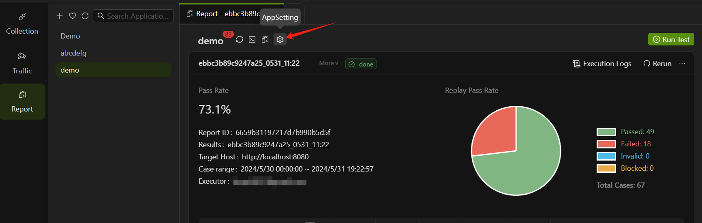
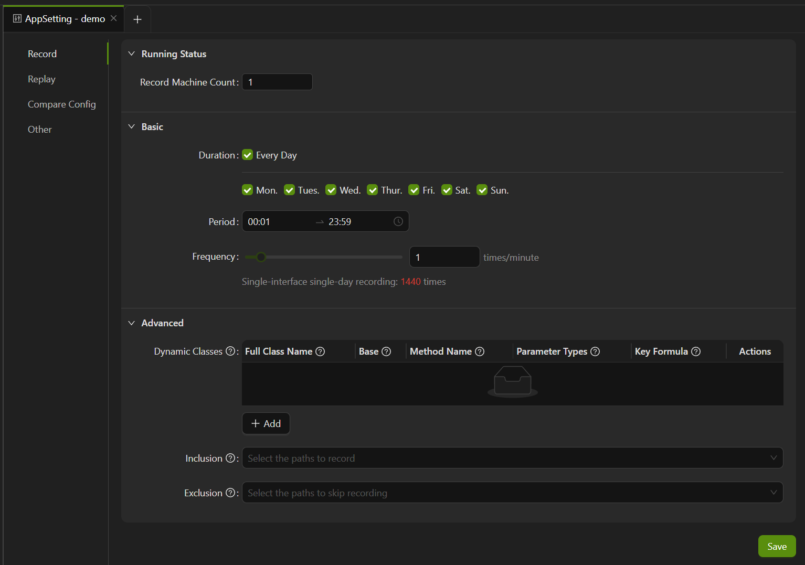
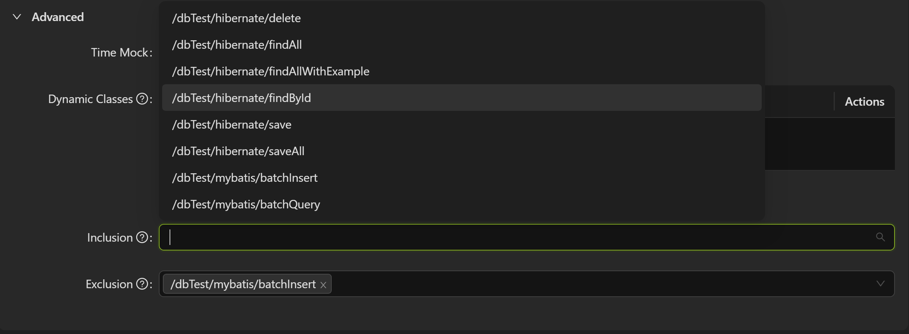

import { Callout } from 'fumadocs-ui/components/callout';

前往 **Report**，点击页面中应用名右侧的**设置**（AppSetting）按钮，进入应用设置页面。



## 录制设置

AREX 支持对特定时间段的流量进行周期性录制，你可以根据自己的需要进行自定义设置。点击 **Record**，进入录制设置页面。



### Agent 运行状态

运行状态（Running Status）此处显示被测试应用的 AREX Agent 的状态，方便测试人员查看当前服务的 Agent 是否正常运行，从而及时发现和解决问题，保证测试过程的可靠性和稳定性。

- **录制机器数量（Record Machine Count）**：如果有两个及以上的机器需要进行录制，需在这里修改机器数量。

- **Host**：配置了 AREX Agent 主机的 IP 地址。

- **Version**：当前 Agent 版本。

- **Modified Time**：修改时间。

- **Status**：Agent 工作状态。
    - SLEEPING: Agent 已注入，但不录制
    - UNSTART: Agent 未注入
    - WORKING: 正在录制

### 录制频率设置

**Duration**：设置录制应用的时间，可以选择每天都进行录制，或者仅录制一周内的任意几天的流量。

**Period**：设置每天录制的时间段，00:00 ~ 24:00 任意时间段均可选择。

**Frequency**：设置录制频率，范围为“1~100”，单位为“次/分钟”，即每分钟执行录制的次数。

### 动态类配置

实际应用中会使用各式缓存来提升运行时的性能，为了避免由于缓存数据的差异导致的执行结果不一致的问题，AREX 也支持了本地缓存数据的采集和 Mock 功能。

实现方法是将访问本地缓存的方法配置成一个动态类，这样你可以自定义这个方法进行 Mock。在生产环境中，AREX 会记录你配置的这个动态类方法的数据，并在回放时返回匹配到的相应数据。匹配的顺序如下：

1. 根据请求参数进行精确匹配，如果能够找到匹配的录制数据，就直接返回。
2. 如果精确匹配不到数据，则进行模糊匹配。

动态类的模糊匹配规则如下：

1. 必须是相同的方法签名，包括方法名、请求参数类型和参数个数。
2. 如果相同方法签名的精确匹配不到数据，则会根据录制时间返回最新的录制数据。

除了缓存数据，也可以 Mock 各种内存数据。如有需要 Mock 的动态类数据，可点击 “**+ Add**” 进行配置。具体配置说明如下：

  - **Full Class Name**： 本地缓存的类名，必须为全类名。以下是 AREX 中支持动态类配置的示例，用于模拟内存中的类数据。

        - 中缀：在包路径中匹配任意包含 namic 的类，例如  io.arex.inst.dynamic.*namicTest*
        - 后缀：在包路径中匹配以 namicTestClass 结尾的类，例如  io.arex.inst.dynamic.*namicTestClass
        - 前缀：在包路径中匹配以 DynamicTest 开头的类，例如 io.arex.inst.dynamic.DynamicTest*
        - 等于：在包路径中匹配类名为 DynamicTestClass 的类，例如 io.arex.inst.dynamic.DynamicTestClass
        - 抽象类或接口：匹配抽象类或接口，其中 ac: 表示 abstract class 的缩写，例如 ac:io.arex.inst.dynamic.AbstractDynamicTestClass表示匹配 AbstractDynamicTestClass 抽象类。

        这些配置用于指定需要 mock 的动态类的包路径和类名等信息。在配置完成后，AREX 将会自动 mock 这些类，在测试过程中使用。
  - **Base**：Base 表示基类，如果标注为基类，表示这个基类下面的子类或实现类都 Mock 生效。
  - **Method Name**： 需要 Mock 的方法名。
  - **Parameter Types**：所有参数的类型，需为全类名，多个以“@”分隔。primitive 类型缩写即可， 如 java.lang.String。
  - **Key Formula**：Key Formula（参数表达式）的使用场景是为了指定只录制参数的某个属性，避免录制整个对象，从而减少录制报文的大小。

    举个例子，假设我们要将下面这个方法配置为动态类：
    
    `public String getOrder(Request req) { return result; }`

    如果我们只想录制参数 `req` 中的一个属性 `name`，那么参数表达式可以这样写： `#req.getName()`。在这里，`#req` 表示第一个 Request 参数声明的变量名。

    参数表达式还可以解决一种问题场景，即某些参数不支持序列化，但你仍然需要录制这个动态类方法。通过参数表达式，你可以指定只序列化其中某个属性，从而避免序列化问题的发生。

如果使用的是开源缓存框架，如 Spring Cache、Guava Cache 或 Caffeine Cache，就无需配置动态类。只需在启动参数中添加`-Darex.coverage.packages=com.your.package`，并替换 com.your.package 为项目中实际使用缓存的包名。请注意，这里填写的包名不是缓存框架所在的包，而是业务代码中使用缓存的包名。

:::tip

这里以 `System.currentTimeMillis()`、`UUID`、`泛型` 为例说明如何进行动态类配置。

1. 如代码中使用 `java.lang.System#currentTimeMillis`：
  
```
package com.your.service;
public class TestService {
public void testDemo(String s) {
...
  long l = System.currentTimeMillis();
  if (l > s) {
    ...
  }
...
}
}
```
| FullClassName             | MethodName | ParameterTypes         | keyFormula                          |
|---------------------------|------------|------------------------|-------------------------------------|
| com.your.service.TestService  | testDemo   | java.lang.String       | java.lang.System.currentTimeMillis  |

2. 如代码中使用 `UUID`：
  
```
package com.your.service;
public class TestService {
  public void testDemo(String s) {
    ...
    String transId = UUID.randomUUID().toString();
    if (!qpsLimiter(transId)) {
      ...
    }
    ...
  }
}
```
| FullClassName             | MethodName | ParameterTypes         | keyFormula                          |
|---------------------------|------------|------------------------|-------------------------------------|
| com.your.service.TestService  | testDemo   | java.lang.String       | java.util.UUID.randomUUID           |

3. 如代码中使用 `泛型`：
  
```
package com.your.entity;
public class ChangeResponseModel {
    private String field;
}
package com.your.service;
public class TestGenericService {
    public ProcessResult<ChangeResponseModel> testDemo(String s) {
        ChangeResponseModel model=new ChangeResponseModel();
        ...
        if (!qpsLimiter(s)) {
            ...
        }
        ...
        return ProcessResult.buildResult(model);
    }
}
```
| FullClassName                    | MethodName | ParameterTypes         | keyFormula                          |
|----------------------------------|------------|------------------------|-------------------------------------|
| com.your.service.TestGenericService  | testDemo   | java.lang.String       | T:com.your.entity.ChangeResponseModel   |

:::

<Callout title="注意">动态类配置不需要配置 `void` 的方法，因为没有返回结果，Mock 了也没意义。配置保存后，需要重启服务。或者在启动参数中加入：`-Darex.retransform.instrumentation.module=dynamic-class`，之后无需重启即可生效。</Callout>

**Inclusion**：下拉菜单中列出的是所有在录制过程中访问到的接口路径，勾选后将仅录制选中的路径。



**Exclusion**: 勾选后即可在之后的录制过程中跳过这些路径，不进行录制。
