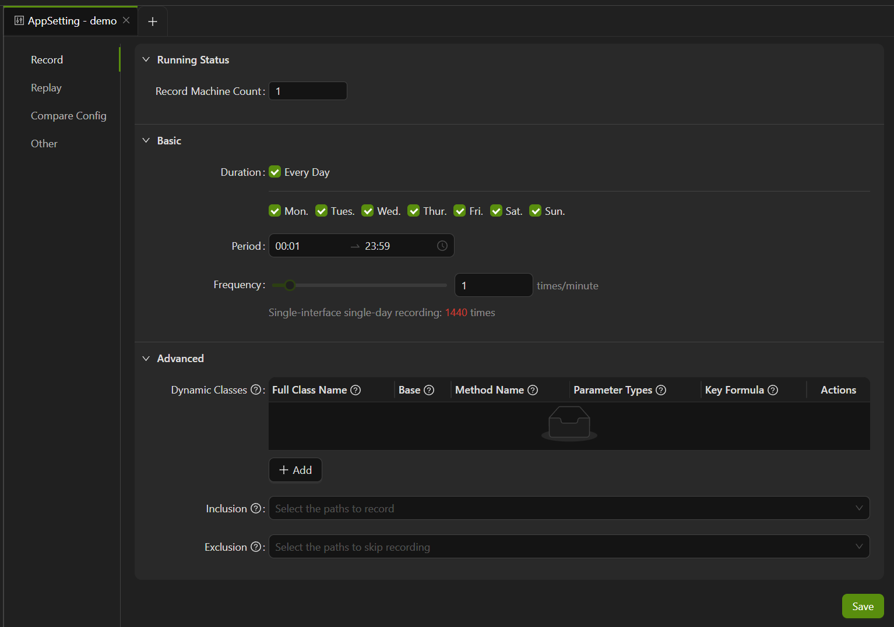

import { Callout } from 'fumadocs-ui/components/callout';

## AppSetting

Go to **Report**, click on the **AppSetting** button to the right of the application name on the page, to enter the application settings page.



### Recording setting

AREX supports periodic recording of traffic for specific time periods, and you can customize the settings according to your needs. Click on **Record** to enter the recording settings page.

### Agent Running Status

The running status section displays the status of the AREX Agent for the tested application. It allows testers to check if the Agent is running properly, enabling them to promptly identify and resolve any issues, ensuring the reliability and stability of the testing process.

- **Record Machine Count**: If there are two or more machines that need to be used for recording, you can modify the machine count here.

- **Host**: The IP address of the configured AREX Agent host.

- **Version**: The current version of the Agent.

- **Modified Time**: The time of the last modification.

- **Status**: The working status of the Agent.
    - SLEEPING: Agent is injected but not recording.
    - UNSTART: Agent is not injected.
    - WORKING: Agent is currently recording.

### Recording frequency

**Duration**: Select the day to record the application, you can choose to record every day, or just for any days of the week.

**Period**: Select the time period from 00:00 ~ 24:00 for daily recording.

**Frequency**: Select the recording frequency from "1~100", with a unit of "times/minute", meaning the number of recordings per minute.

#### Dynamic Classes

In practical applications, various types of caching are used to improve runtime performance. To avoid inconsistent results due to differences in cached data, AREX also supports the collection and mocking of local cache data.

The implementation method is to configure the method that accesses the local cache as a dynamic class, allowing you to customize this method for mocking. In the production environment, AREX will record the data of the dynamic class method you configured and return the matching data during playback. The matching order is as follows:

1. Perform an exact match based on the request parameters. If a matching recording data is found, it will be returned directly.
2. If an exact match cannot be found, perform a fuzzy match.

The fuzzy matching rules for dynamic classes are as follows:

1. The method signature must be the same, including the method name, request parameter types, and parameter count.
2. If an exact match cannot be found for methods with the same signature, the latest recorded data will be returned based on the recording time.

In addition to caching data, various types of memory data can also be mocked. To configure dynamic class data that needs to be mocked, click "**+ Add**". Here are the specific configuration instructions:

- **Full Class Name**: The full class name of the local cache, such as java.lang.String.
    - Infix: Matches any class in the package path that contains “namic”, for example, io.arex.inst.dynamic.namicTest.
    - Suffix: Matches any class in the package path that ends with “namicTestClass”, for example, io.arex.inst.dynamic.*namicTestClass.
    - Prefix: Matches any class in the package path that starts with “DynamicTest”, for example, io.arex.inst.dynamic.DynamicTest*.
    - Equals: Matches the class “DynamicTestClass” in the package path, for example, io.arex.inst.dynamic.DynamicTestClass.
    - Abstract class or interface: Matches abstract classes or interfaces, where “ac” stands for “abstract class”, for example, ac:io.arex.inst.dynamic.AbstractDynamicTestClass matches the abstract class “AbstractDynamicTestClass”.

    These configurations are used to specify the package path and class name information of the dynamic classes that need to be mocked. After the configuration is completed, AREX will automatically mock these classes for use during testing.
- **Base**: The term "Base" refers to a base class. If checked as a base class, it indicates that all subclasses or implementations under this base class are subject to Mock effectiveness.    
- **Method Name**: The method name to be mocked.
- **Parameter Types**: The full class names of all parameters, separated by "@". Primitive types can be abbreviated, such as int.
- **Key Formula**: Key Formula is used to specify that only a certain attribute of the parameter is to be recorded, avoiding the recording of the whole object and thus reducing the size of the recorded message.

  As an example, suppose we are going to configure the following method as a dynamic class:
    
  `public String getOrder(Request req) { return result; }`

  If we want to record only one attribute `name` in the parameter `req`, then the **Key Formula** can be written like this: `#req.getName()`. In this case, `#req` represents the name of the variable declared in the first Request parameter.

  The Key Formula can be utilized to address scenarios where certain parameters do not support serialization, yet it is necessary to record the dynamic class method. By employing a parameter expression, you can specify the serialization of only one property, effectively mitigating serialization issues.

If you are using an open-source caching framework such as Spring Cache, Guava Cache, or Caffeine Cache, there is no need to configure dynamic classes. Simply add `-Darex.coverage.packages=com.your.package` to your startup parameters, replacing `com.your.package` with the actual package name used for caching in your project.

Please note that the package name you enter here is not the package where the caching framework is located, but rather the package in your business code that utilizes the cache.

Here are examples of how to configure dynamic classes using `System.currentTimeMillis()`, `UUID`, and generics.

1. Example using `java.lang.System#currentTimeMillis` in the code:

```
package com.your.service;
public class TestService {
public void testDemo(String s) {
...
  long l = System.currentTimeMillis();
  if (l > s) {
    ...
  }
...
}
}
```
| FullClassName             | MethodName | ParameterTypes         | keyFormula                          |
|---------------------------|------------|------------------------|-------------------------------------|
| com.your.service.TestService  | testDemo   | java.lang.String       | java.lang.System.currentTimeMillis  |

2. Example using `UUID` in the code:

```
package com.your.service;
public class TestService {
  public void testDemo(String s) {
    ...
    String transId = UUID.randomUUID().toString();
    if (!qpsLimiter(transId)) {
      ...
    }
    ...
  }
}
```
| FullClassName             | MethodName | ParameterTypes         | keyFormula                          |
|---------------------------|------------|------------------------|-------------------------------------|
| com.your.service.TestService  | testDemo   | java.lang.String       | java.util.UUID.randomUUID           |

3. Example using generics in the code:

```
package com.your.entity;
public class ChangeResponseModel {
    private String field;
}
package com.your.service;
public class TestGenericService {
    public ProcessResult<ChangeResponseModel> testDemo(String s) {
        ChangeResponseModel model=new ChangeResponseModel();
        ...
        if (!qpsLimiter(s)) {
            ...
        }
        ...
        return ProcessResult.buildResult(model);
    }
}
```
| FullClassName                    | MethodName | ParameterTypes         | keyFormula                          |
|----------------------------------|------------|------------------------|-------------------------------------|
| com.your.service.TestGenericService  | testDemo   | java.lang.String       | T:com.your.entity.ChangeResponseModel   |

<Callout title="Tip">You don't need to configure the `void` method for dynamic class configuration, because there is no result to return, and it's pointless to mock it.</Callout>

**Exclusion**: Here are all the interface paths accessed during the recording process. Selecting them to skip these paths during subsequent recording.


