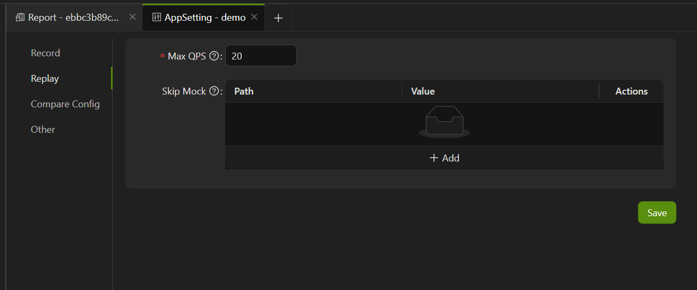

import { Callout } from 'fumadocs-ui/components/callout';

前往 **Report -> AppSetting -> Replay**，进入应用回放设置页面。

**Max QPS**：为了减轻用户被测机器的负载，可以在应此根据需要修改最大回放 QPS 数量。

**Skip Mock**：对于某个接口，如果存在一些第三方依赖的路径不需要进行 Mock，可点击 “**+ Add**” 添加忽略路径，回放时 AREX 不会对这些依赖的路径进行 Mock，即会产生真实的调用。

<Callout title="Tip">
排除模板目前支持下面几种类型：

| 类型     | path                  | value                                                      |
| -------- | --------------------- | ---------------------------------------------------------- |
| database | 数据库名              | 方法名（update、query、delete） ，不填则默认该库下所有方法 |
| dubbo    | 服务名                | 接口名（不填则默认该服务下所有接口）                       |
| http     | http（固定值）        | 接口名（不填则默认所有）                                   |
| redis    | clusterName（集群名） | command（不填则默认该集群下所有命令）                      |
| 动态类   | 类名                  | 方法名（不填则默认该类下所有方法）                         |
</Callout>
