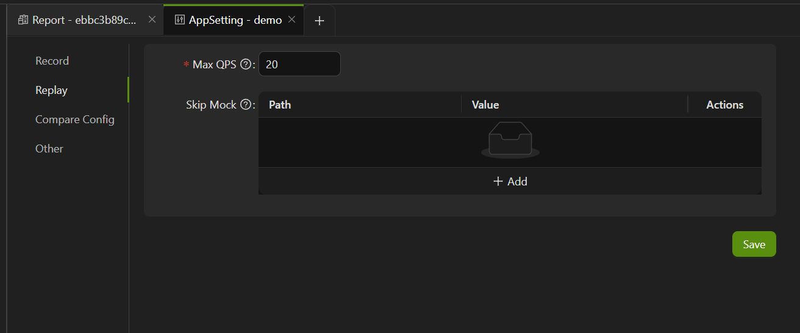

import { Callout } from 'fumadocs-ui/components/callout';

Go to **Report -> AppSetting -> Replay** to enter the application replay settings page.

**Max QPS**: In order to reduce the load on the user's machine under test, the maximum number of playback QPS can be modified as needed.

**Skip Mock**: If there are some third-party dependency paths that should not be mocked, you can click "**+ Add**" to add paths to ignore. During replay, AREX will not mock these dependencies, meaning that actual calls will be made.

<Callout title="Tip">
The exclusion template currently supports the following types of exclusion comparisons:

| Types     | path                  | value                                                      |
| -------- | --------------------- | ---------------------------------------------------------- |
| database | database name            | Method name (update, query, delete). If not filled in, all methods under this library will be defaulted  |
| dubbo    | service name          | Interface name (if not filled in, all interfaces under this service are defaulted)                       |
| http     | http (Fixed value)         | Interface name (default all if not filled)                                   |
| redis    | clusterName | command (If not filled in, all commands under this cluster will be defaulted)                      |
| Dynamic classes  | class name                 | Method name (default to all methods under this class if not filled)                         |
</Callout>
