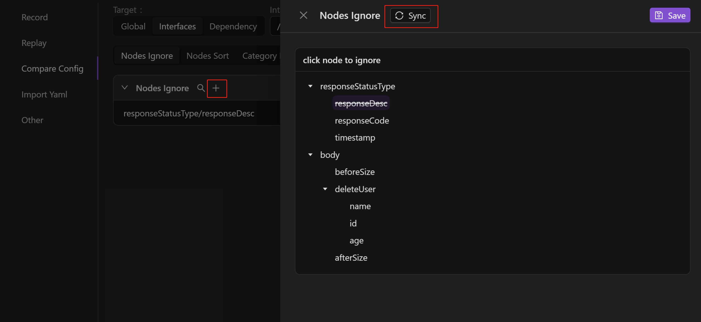

import { Callout } from 'fumadocs-ui/components/callout';

如果响应报文中存在时间戳、随机数、ip 等数据，即使系统代码无改动，由于跨环境数据不一致，同一接口返回值不同，回放比对时也会出现差异点，对使用者排查成本过高。为消除由这些数据不一致带来的回归对比验证失败的噪音，提高回放通过率，排除无意义的比对差异，可以通过手动或系统智能推荐的方式，进行降噪过滤，包括忽略不必要的比对字段、进行数组乱序比对等，减少误报率，提高排查效率。

> 针对录制回放的比对，系统中默认存在一些自定义配置，例如不对比数据库的 select 操作等。为了更方便地进行配置和管理，AREX 提供了一个全局通用的配置机制。

另外，响应报文 (JSON) 中的某些节点可能进行了 Base64 编码，导致比对失败，针对这种情况可以在系统设置中进行配置，对 JSON 报文中的特定节点进行 [Base64 解码](Compare%20Config.md#base64-解码配置)，完成解码后的数据将用于后续的内容校验，确保数据比对的准确性。

<Callout title="Tip">
忽略节点和数组乱序比对需要至少回放一次后才可进行配置。
</Callout>

## 智能降噪

当用户启动回放后，AREX 会预先选取同一用例在同一回放环境下进行两次预回放，并通过对比它们之间的流量差异，找出其中的“噪声”点。在真正的回放结束后，AREX 会生成对比配置推荐列表。

需要先生成一次回放报告，回放生成后，点击 **Comparative Config Recommendation（比对配置推荐）** 按钮查看系统推荐的忽略比对字段，根据需要对噪音字段进行忽略配置。

## 手动降噪

你也可以手动在应用配置处进行配置，或者在回放报告的节点差异分析中直接配置。

### 应用配置

在回放生成一次后，前往 **Replay > AppSetting > Compare Config** 进行配置。

**Global（全局级别）**

- Nodes Ignore：可以在这里添加该应用下的全局忽略节点，点击 “**+**” 添加需要忽略的 Key，配置完成后，该应用下的所有接口进行回放时，都将自动跳过该节点的比对。

- Category Ignore：这里可以忽略对指定类型的第三方调用的比对。配置后，下次回放会对该应用所有接口下该种类型的比对进行忽略。

**Interfaces（接口级别）**

- Nodes Ignore：这里可以对应用下的单个接口配置忽略节点。

1. 点击“**Sync**”，识别该应用在上次回放测试中访问到的所有路径，选择需要进行忽略比对配置的路径。

    

2. 点击 “**+**” 添加节点，然后点击 “**Sync**” 可以识别该接口在上次回放测试中所访问的所有节点，选择需要进行忽略的节点，点击 **Save** 保存即可。

    

- Category Ignore：这里可以忽略对指定类型的第三方调用的比对。

**Dependency（第三方依赖级别）**：这里可以对应用下的单个接口的第三方依赖进行忽略节点配置。

1. 点击 “**Sync**”，识别该应用在上次回放测试中访问到的所有接口和对应的第三方依赖，依次选择需要进行忽略比对配置的路径和第三方依赖。

    

2. 点击 “**+**” 添加节点，然后点击 “**Sync**” 可以识别该第三方依赖在上次回放测试中所访问的所有节点，选择需要进行忽略的节点，点击 **Save** 保存即可。

    

### 回放报告

待回放报告生成后，前往 **Report > ReplayCase** 进行配置。

点击某录制 **Case**，点击右上角 **Compare Config** 按钮，进行比对配置。操作同上。

## 数组乱序比对

通常情况下，响应报文中的一个数组中会存在多个元素，录制、回放的响应报文中往往会出现元素前后顺序不一致的问题，导致明明是相同的返回结果，却导致回放失败。

**Nodes Sort** 可通过配置数组中元素的键，避免在回放过程中因响应报文中数组内元素排序不同而导致回放失败的问题。

### 应用配置

在回放生成一次后，前往 **Setting > Compare Config** 进行配置。

:::tip

乱序数组比对仅对**接口(Interface)/第三方依赖(Dependency)**维度有效。无法设置全局数组乱序比对。

:::

1. 依次选择 **NodeSort > Interface**，点击 **“Sync”**，识别该应用在上次回放测试中访问到的所有路径，选择需要进行数组乱序比对配置的路径。

    

2. 点击 **“+”** 添加节点，然后点击 **“Sync”** 可以识别该接口在上次回放测试中所访问的所有数组节点，选择需要进行配置的数组名，勾选该数组下的某个或多个键作为该数组元素唯一标识的键组，并点击 Save 保存。

    

    回放测试时，AREX 将不再根据数组元素先后顺序进行一一比对，而是通过先前设定的键组在录制、回放报文中找到数组中同一元素进行比对，避免因元素顺序不一致而出现差异。

    **例**：如下所示报文，`users` 数组中含有多个元素，在请求发送后，返回结果中 `id` 为 `1` 及 `id` 为 `2` 的两个元素前后顺序是随机的，这时如果不做任何配置，AREX 将按照从前到后的顺序依次对录制与回放的响应报文进行比对，则很可能出现将录制的响应报文`users` 数组中出现的第一个元素（`id` 为 `1`）与回放的响应报文`users` 数组中出现的第一个元素（`id` 为 `2`）进行比对，导致回放失败。

    
    
    因此需要同时勾选 `id`、`name` 作为该 `users` 数组元素的唯一标识，回放时将通过 `id`、`name` 在录制与回放的响应报文中找到同一元素进行比对。如果只勾选 `name` 作为标识，那么在存在同名的情况下，仍旧会出现回放失败的结果。
    
    同理，该数组中的 `phoneNumbers` 数组也可以通过勾选 `type` 来完成配置。

### 回放报告

待回放报告生成后，前往 **Replay > Case** 进行配置。操作同 **[手动降噪 > 回放报告](./Compare%20Config#回放报告)**。

## Base64 解码配置

点击右上角头像进入 System Setting 页面，在高级设置 (Advanced) 中添加转换方法的 JAR 地址，如：`https://s01.oss.sonatype.org/service/local/repositories/releases/content/com/arextest/arex-compare-plugin/0.0.1/arex-compare-plugin-0.0.1.jar`。

> 示例 JAR 源码地址：https://github.com/arextest/arex-extension/tree/arex-compare-plugin

之后，在生成的回放报告中点击失败用例，在差异界面点击右上角的设置按钮。

点击 Nodes Transform，添加转换处理方法 (Add Transform Node)。

在 Original Node 中，选择需要进行解码的节点，点击 Select 确认。

在 Method name 中选择需要解码的方式，如：Base64、ZSTD 或 Gzip。

转换配置支持**流式转换处理**，点击删除按钮旁边的插入图标 (Insert Before/After) 即可添加。假设这样一个场景：如果一个报文节点在业务代码中先进行了 Base64 编码，再进行 ZSTD 压缩，那么可以在这里先添加 ZSTD 解压，再添加 Base 64 配置，比对时 AREX 会先进行 ZSTD 解压，再进行 Base64 处理。

转换方法支持**方法传参**配置，AREX 会将方法参数（Method args）中配置的内容，传入到转换方法中。

示例：某 JSON 报文中有两个节点 A：`zstd_KLUv/SAFKQAAYWFhYWE=` 和 B：`KLUv/SAFKQAAYWFhYWE=`，这两者都经过了 ZSTD 压缩，区别在于节点 A 存在前缀 `zstd_`，而 B 没有。为了能够正确解压 A、B 两种不同类型的节点，需要一个通用的解压 ZSTD 压缩数据的方法。在这个场景下，可以在 Method args 中配置前缀 `zstd_`，AREX 会截取掉传入的方法参数（即该示例中的 `zstd_` 前缀），然后对 A、B 两节点进行通用的 ZSTD 解压处理。
