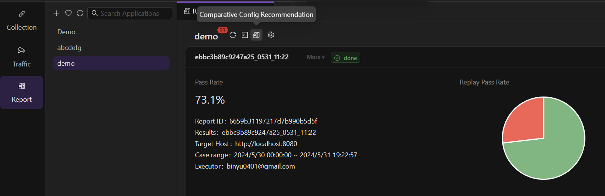
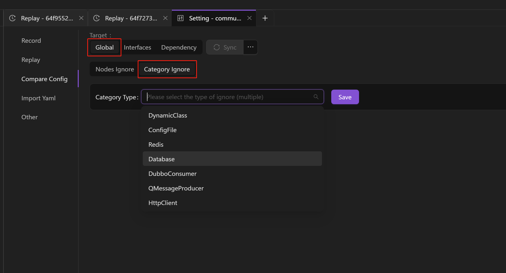
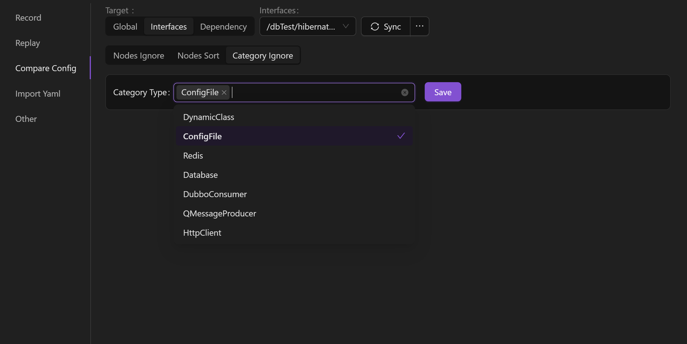
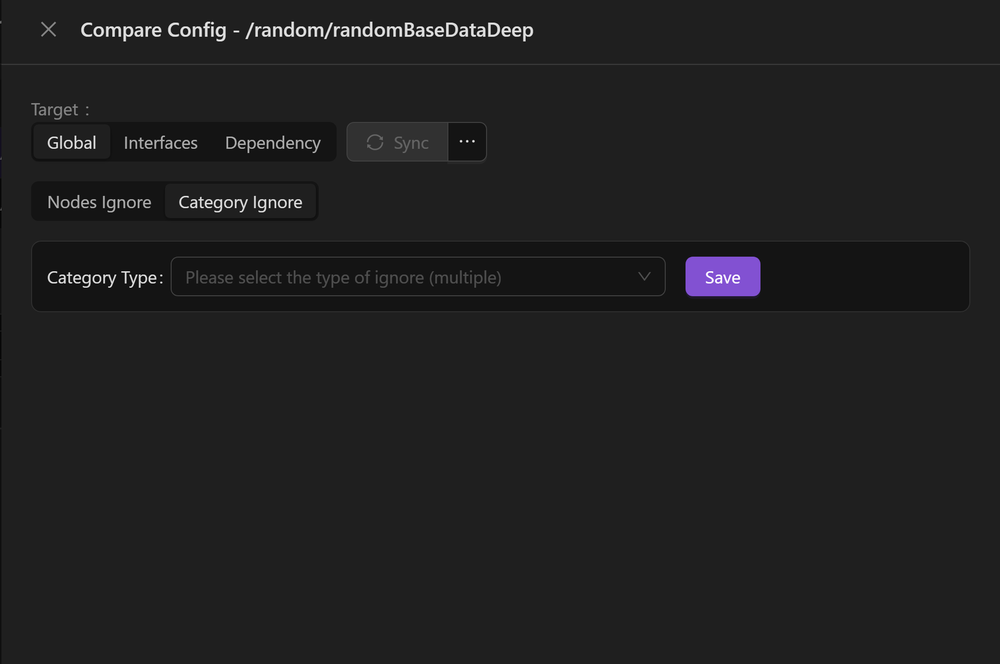
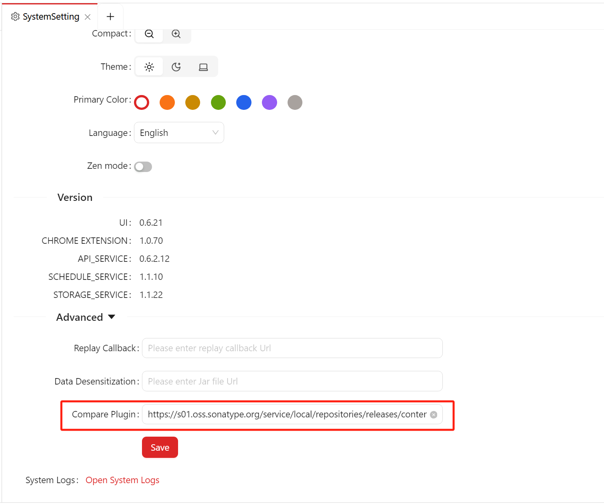
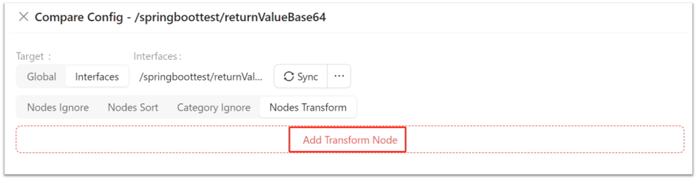
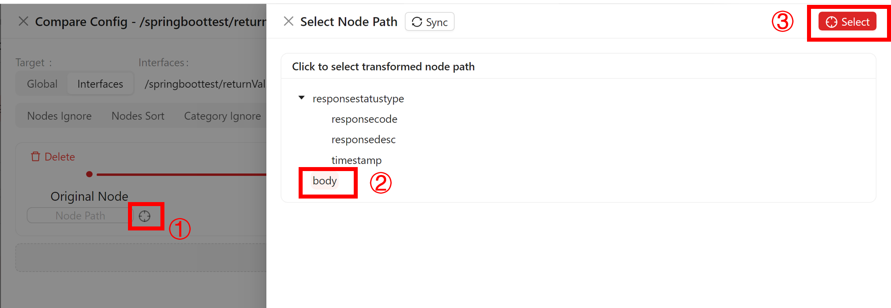
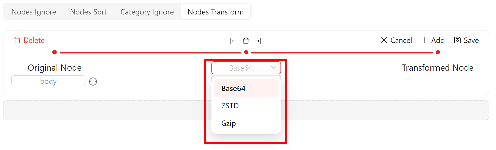
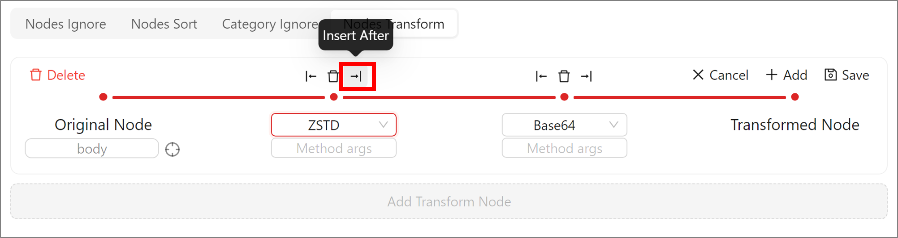

import { Callout } from 'fumadocs-ui/components/callout';

If there are timestamps, random numbers, ip and other data in the response message, even if there is no change in the system code, due to the inconsistency of the data across environments and the different return values of the same interface, there will be discrepancies in the playback comparison, which is too expensive for the user to troubleshoot. In order to eliminate the noise brought by these data inconsistencies in the regression comparison verification failure, improve the replay pass rate, and exclude meaningless comparison differences, noise reduction can be carried out manually or by means of the system's intelligent recommendations, including ignoring unnecessary comparison fields, array disorder comparison, etc., so as to reduce the rate of false positives and improve the efficiency of troubleshooting.

> AREX has default configurations for comparison, such as excluding the comparison of `select` operations in the database. To facilitate configuration and management, AREX provides a global configuration approach.

In addition, some nodes in the response message (JSON) may be Base64 encoded, which may cause the comparison to fail. In this case, you can configure the system settings to perform [Base64 Decoding Configuration](Compare%20Config#base64-decoding-configuration), the decoded data will be used for subsequent content validation to ensure the accuracy of data comparison.

<Callout title="Tip">
A replay test is required before noise reduction can be performed, including ignoring nodes and disordered array comparisons.
</Callout>

## Intelligent noise reduction

When the user start a replay test, AREX pre-selects two test cases on the same interface, pre-plays them in the same replay environment, and identifies the "noise" by comparing the traffic differences between them. After the real replay, AREX generates a list of recommended configurations for comparison.

You need to generate a replay report first. After the playback is generated, click the **Comparative Config Recommendation** button to view the system's recommended ignored comparison fields, and configure the noise fields to be ignored as needed.

## Manual noise reduction

You have two options to reduce noise manually. You can either configure the **AppSetting** or adjust it in the replay report.

### Configure in Application Setting

After the replay testing, go **Replay > AppSetting > Compare Config** to configure.

**Global**

- Nodes Ignore: You can add the Global Ignore Node under this application here. Click "**+**" to add the node that needs to be ignored. After the configuration is completed, all interfaces under this application will automatically skip the comparison of this node when they are replayed.

- Category Ignore: This is used to ignore the comparison of specified categories of third-party calls. After configuration, the next playback will ignore the comparison of this type for all interfaces of the application.

**Interface**

- Nodes Ignore: You can configure ignore nodes for individual interfaces under the application.

1. Select "**Sync**" to identify all the paths accessed by the application during the last replay test, and select the paths that need to be configured for Ignore Compare.

    

2. Select "**+**" to add a node, then select "**Sync**" to identify all the nodes accessed by the interface in the last replay test, select the nodes that need to be ignored, and **Save** them.

    

- Category Ignore: This is used to ignore the comparison of specified categories of third-party calls. After configuration, the next playback will ignore the comparison of this type under this interface.

    

**Dependency**

You can choose to ignore nodes for third-party dependencies on individual interfaces under the application.

1. Select "**Sync**" to identify all the interfaces and corresponding third-party dependencies that the application accessed in the last replay test, and select the paths and third-party dependencies that need to be ignored for comparison.

    

2. Select "**+**" to add a node, then select "**Sync**" to identify all the nodes accessed by this third-party dependency during the last replay test, select the nodes that need to be ignored, and **Save** them.

    

### Configure in Replay Report

Once the replay report was generated, go **Replay > Case** to configure.

Select a recording **Case** and select the **Compare Config** button in the upper right corner to configure. The operation is the same as above.

## Compare Disorderd Array

Usually, an array in the response contains multiple elements, and the order of elements in the responses returned from two different request URLs often differs, resulting in differences in comparison results even though the returned response are actually the same.

By configuring the keys of the elements in the array, we can avoid the failure of comparison due to different ordering of the elements in the array of the response during the matching process.

### Configure in Application Setting

After the replay testing, go **Replay > Compare Config** to configure.

:::tip

Disordered array comparison is only available for **Interface/third-party dependency** dimensions. It is not possible to set a global array comparison. 

:::

1. Select **"Sync"** to identify all the paths accessed by the application during the last replay test, and select the paths in which the disorderd arraies need to be compared.

    

2. Select **"+"** to add a node, and then select **"Sync"** to identify all the array nodes accessed by the interface during the last replay test. Then select the array that you want to compare, and check one or more keys under the array to uniquely identify that array element. Select the array name you want to configure, check one or more keys under the array to uniquely identify the array elements, and click Save to save.

    

    And then AREX will no longer compare elements one by one in the order of the array elements during replay, but will find the same element in the two sets of response through the previously set key group and compare them one by one to avoid differences due to inconsistent element order.

    **For example**：As shown below, the users array contains multiple elements, and after the request is sent, the order of the two elements with `id` of `1` and `id` of `2` in the return result is random. Without **Nodes Sort**, it will compare the first element in users array (the `id` is `1`) of recorede response with the first element in the same array (the `id` is `2`) of the replay response, resulting in a failue of replay.

    
    
    So you need to check both `id` and `name` as the unique identifier of this `users` array element, and the same element will be found in the recorded and played back response messages by id and name for comparison during playback. If only name is checked as the identifier, the playback will still fail if there is an identical name.

    Similarly, the `phoneNumbers` array in this array can be configured by checking type.

### Configure in Replay Report

Once the replay report was generated, go **Replay > Case** to configure. The operation is the same as **[Ignore Nodes > Configure in Replay Report](./Compare%20Config#configure-in-replay-report)**.

## Base64 Decoding Configuration

Click on the avatar in the upper right corner to **System Setting** page, and add the JAR address of the conversion method in the Advanced settings, for example:`https://s01.oss.sonatype.org/service/local/repositories/releases/content/com/arextest/arex-compare-plugin/0.0.1/arex-compare-plugin-0.0.1.jar`。

> Source code address: https://github.com/arextest/arex-extension/tree/arex-compare-plugin

After that, click on failed test cases in the generated report and select the settings button in the Differences.

Select **Nodes Transform** to **Add Transform Node**.

Select the node to be decoded in **Original Node**, and click Select to confirm.

In Method name, select the method you want to decode, e.g. Base64, ZSTD or Gzip.

The conversion configuration supports **Streaming Conversion Processing**, which can be added by clicking the Insert Before/After icon next to the Delete button. Assuming a scenario where a node has Base64 encoding and then ZSTD compression, you can add ZSTD decompression and then Base 64 configuration here, and AREX will perform ZSTD decompression first and then Base64 processing when comparing.

Conversion methods support **Method Passing** configurations, where AREX takes what is configured in the `Method args` and passes it into the conversion method.

For example: A JSON message has two nodes A: `zstd_KLUv/SAFKQAAYWFhYWE=` and B: `KLUv/SAFKQAAYWFhYWE=`, which are ZSTD compressed, the difference is that node A has the prefix `zstd_`, while node B does not. In order to properly decompress the two different types of nodes A and B, a generic method for decompressing ZSTD compressed data is needed. In this scenario, you can configure the prefix `zstd_` in the Method args, and AREX will intercept the incoming method arguments (i.e., `zstd_` in this example), and then perform a generic ZSTD decompression process for both A and B nodes.
