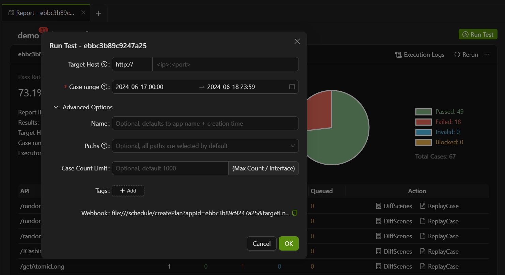
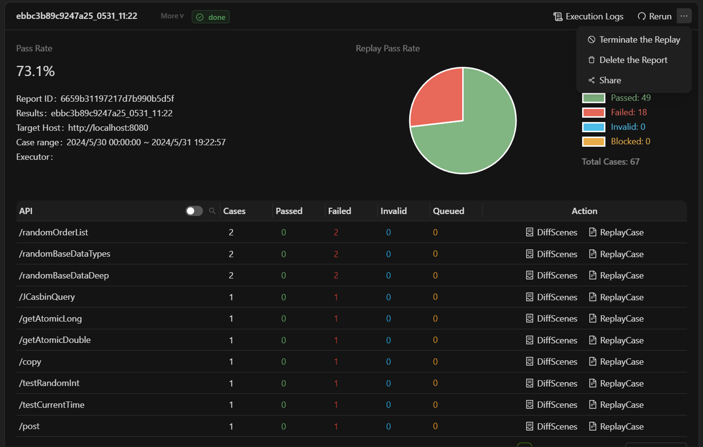
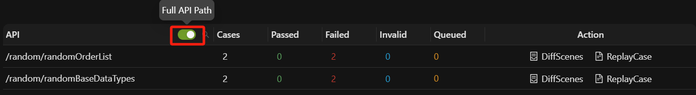
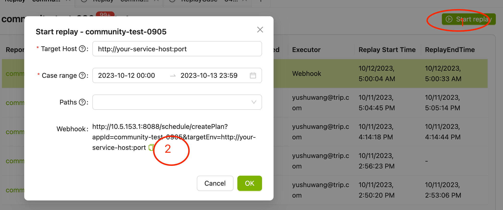
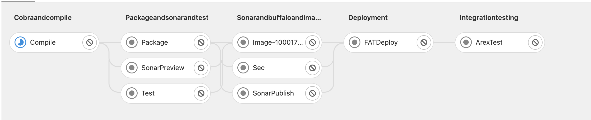
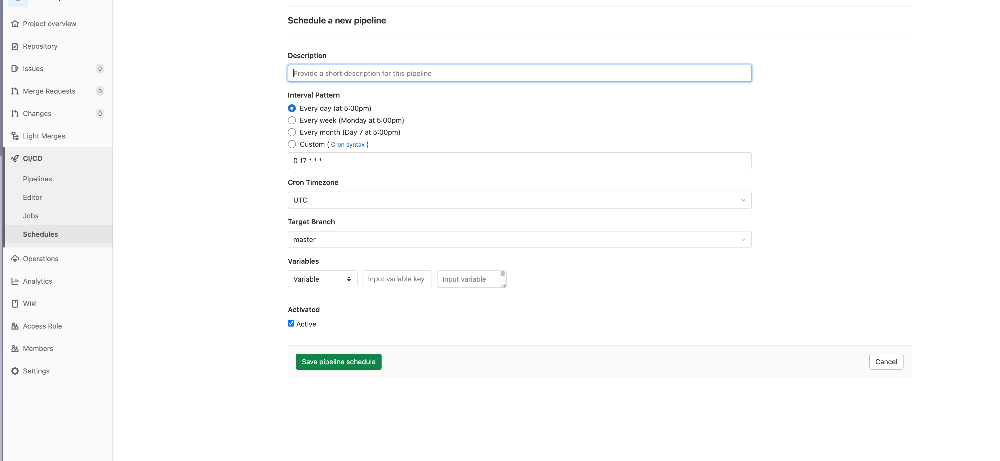

import { Callout } from 'fumadocs-ui/components/callout';

流量录制回放是通过录制生产环境的高保真数据，并快速地在测试环境中进行回放比对接口返回值和中间链路的验证，以减少繁杂的回归测试、用例维护的重复性劳动，提升回归测试效率。

<Callout title="Tip">
不建议在生产环境回放，一般来说生产环境只录制流量，回放在测试环境或本地操作。
1. 请先确认**生产环境**中用于录制的应用在配置 AREX Agent 后是否有流量请求，如果没有，则录制内容为空，无法进行回放。
2. **测试环境**中的被测应用也需要部署 Agent（详见：[部署 Agent 启动应用](../chapter2/create-app#步骤三部署-agent-启动应用)），才能进行回放（且回放的机器需要关闭录制，即录制频率调整为 0）。回放过程对主接口将产生真实调用，而对外部第三方依赖（如数据库、Redis 等）则不会产生真实的调用，如果子调用入参与录制子调用的入参相同，则直接返回录制的数据。
</Callout>

## 开始回放

应用录制并设置完成后，可以进行回放操作。

点击需要进行回放测试的应用，进入回放报告页面。点击右上角 **Run Test**，即可进行回放。


在跳转出的窗口中依次填入：

- **目标回放地址（Target Host）**：本地/测试环境中需要进行回放测试的端口地址，即搭载了 Agent 的机器/被测机器的端口地址。完整的 **Target Host** 应该是协议+域名+端口号（默认的 80 端口也需要手动输入）。
- **回放用例范围（Case range）**：选择回放用例范围，对该日期区间内录制到的线上请求进行回放。



- **报告名（Name）**：自定义报告名称，默认命名规则是 **应用名+创建时间**。
- **回放路径（Paths）**：选择本次测试中需要进行回放的接口路径，如没有设定，则默认回放所有路径下的用例。
- **最大回放用例数（Case Count Limit）**：设定单个接口最大回放用例数，默认单个接口单次回放最大用例上限是 1000 个/接口。
- **Webhook**：用于创建定时回放任务，参考>>[定时回放](Traffic%20Replay%20Test#定时回放)。

### 回放报告

回放任务进行时，可以点击报告右上方下拉列表中的 **Terminate the Replay** 中断回放。



回放任务状态变为 **"done"** 时回放完成，生成回放报告，详细说明如下：

- **Delete the Report**：删除该回放报告。

- **Rerun**：重新进行回放。

- **Execution Logs**：查看回放日志。

- **Pass Rate**：回放用例测试通过率。(录制回放返回结果无差异视为通过)

- **API Pass Rate**：接口测试通过率。

- **API**：录制及回放中访问的所有接口列表，默认仅展示路径的最后部分，点击右侧的按钮可以切换为完整路径。
  

- **Time consumed(s)**：该接口回放测试的执行时间，单位为“s”。

- **Total Cases**：该接口下测试用例的个数。

- **Passed、Failed、Invalid、Blocked**：分表表示回放通过、失败、无效、中断的测试用例个数。

## 分析报文差异

接口用例中出现 **Failed** 说明回放与录制返回报文出现差异，点击右侧的 **DiffScenes**，查看差异。

在实际使用过程中，对于一个复杂的线上应用，业务场景复杂，录制及回放的用例数量巨大，大大增加了排查问题的难度。

为了减轻使用者分析差异时的工作量，AREX 对存在相同差异的场景和差异点进行了聚合处理。

### 差异场景聚合逻辑

在进行流量回放测试时，针对可能出现的用例数量较大的情况，AREX 会通过一些聚合的操作，将相似的用例进行合并，以减少差异点的数量，便于用户对数据进行分析。如下图所示，聚合相似差异场景后，每个差异场景下仅选取一条用例作为展示。

在 AREX 中，一个用例通常由多个步骤组成，每个步骤包含了一个请求和一个响应。请求可以是主入口，也可以是外部调用（包括 DB、Redis 等）。在每个步骤中，都会记录请求的参数和响应结果等信息，用于后续的对比。如果录制与回放时的主入口响应，以及外部依赖的请求均无差异，则视为该用例回放通过。

这里的主入口和外部调用我们称之为 Mock 的类型。

#### Mock 差异类型

每个 Mock 类型的对比差异类型会被分为三种情况：

- **new call**：这种差异类型表示该主入口或外部调用的 Mock 在录制时不存在，但在回放时存在，即新增了调用，通常是因为有新功能的迭代。
- **call missing**：表示在录制时存在，但在回放时缺失了调用，通常是因为项目进行了优化，移除了某些不必要的调用关系。
- **value diff**：表示在录制和回放时都存在，但在对比过程中某些节点有差异。后续章节中会具体介绍如何分析这些差异。


差异用例场景聚合是为了将具有相同 Mock 类型和差异类型的用例聚合在一起形成一个场景，从而帮助用户更快速地了解整个场景中的用例情况，减少用户需要分析的用例数量，提高分析用例的效率。

首先，根据 Mock 的类型和差异类型的组合，AREX 会生成一个唯一的键，将所有用例分类聚合到这些键中，形成一个大分类。如上图中标注的 **①大分类**。

其次，每个大分类中的用例都会再根据具体的 Mock 和差异类型的排列生成一个子唯一键，进一步对用例进行分类。这样做的目的是为了更加细致地分类，以便更快速地分析差异用例，
具体可见上图中 **②小分类** 的示例。每个小分类中有多少个用例数量会标记在该分类的最前面。

### 差异点聚合逻辑

在每个差异场景中，AREX 对相似的差异节点也进行了聚合展示。

在某些大报文的场景下，有些大数组中的差异点会非常多，一方面不利于前端展示，另一方面增加了使用者分析差异点的复杂度。

为了解决这个问题，AREX 将差异点按照模糊路径进行聚合。这里的模糊路径指的是不带数组下标的 JSON 节点路径。例如，一个 JSON 对象中有一个名为 “items” 的数组，数组中有多个元素 “items[0]”、“items[1]”、“items[2]” 等。在模糊路径中，这些路径会被合并为 “items”，从而实现聚合。


#### 差异点差异类型

- **Additional node**：录制或回放后的返回报文中多出的节点。如有，差异点会在报文中以橙色高亮显示。

- **Difference node**：录制及回放后的返回报文中不同的节点。如有，差异点会在报文中以蓝色高亮显示。

## 定时回放

可以参考以下步骤设立定时回放任务。

1. 在回放界面上，点击创建回放，并填入目标服务的主机地址。然后会自动生成一个用于创建回放的接口调用链接（HTTP GET请求）。Case 的时间范围是从调用时间点开始往前的 24 小时。



2.  获取到创建回放的调用链接后，需要一个触发创建的介质：

- 以 Linux 自带的 Crontab 工具为例

  1. 创建一个名为 "routine" 的文件，写入 `0 5 * * * /usr/bin/curl [第一步中复制的创建地址]`（其中"0 5 * * *"是标准 Linux cron 表达式，表示每天的 5 点执行一次）

  2. 使用命令 `crontab routine` 加载上一步中配置的定时任务

  3. 使用命令 `crontab -l` 查看是否成功写入定时任务

- 以 GitLab CI/CD 为例

  1. 建立一个类似的流水线（pipeline）

  

  2. 在 ArexTest Job 脚本中使用 curl 调用 1 中复制的链接

  3. 在仓库-> CI/CD -> Schedules 中创建定时任务来执行流水线

  

## 回放结果回调使用指南

回放结果回调是指在回放计划完成后，系统会通过调用用户自行配置的回调函数接口，将回放计划的相关信息以 POST 方式传递给用户。用户可以根据这些信息进行相应的处理，如监控和报警、统计和分析、自动化流程触发等。

### 配置

在系统设置中配置 `ReplayCallbackUrl`，当回放计划完成时，系统会以 POST 方式调用该 URL：


### 实现

为了实现这个功能，需要用户自己实现一个回调函数接口，入参如下：

```java
public class CallbackInformRequestType {
  private String appId;  // 应用ID
  private String appName;  // 应用名称
  private String planName;  // 计划名称
  private Integer status;  // 回放状态
  private Integer totalCaseCount;  // 总用例数
  private Integer successCaseCount;  // 成功用例数
  private Integer failCaseCount;  // 失败用例数
  private Integer errorCaseCount;  // 错误用例数
  private Integer waitCaseCount;  // 等待用例数
  private Double passRate;  // 通过率
  private Long elapsedMillSeconds;  // 耗时（毫秒）
  private String creator;  // 创建者
}
```
