import { Callout } from 'fumadocs-ui/components/callout';

Traffic recording and replay is achieved by capturing high-fidelity data from the production environment and quickly replaying it in the testing environment to compare interface return values and verify the intermediate links. This process reduces the repetitive labor involved in extensive regression testing and case maintenance, thereby enhancing the efficiency of regression testing.

<Callout title="Tip">
It is not recommended to perform replays in the production environment. Generally, only traffic is recorded in the production environment, and replays are conducted in the testing environment or locally.
1. First, ensure that the application used for recording in the **production environment** has traffic requests after configuring the AREX Agent. If not, the recording will be empty, and replays cannot be performed.
2. The application under test in the **testing environment** also needs to deploy the Agent (for details, see: [Deploy Agent to Start Application](../traffic-capture/create-app.mdx#step-three-deploy-agent-to-start-application)), in order to perform replays (and the machine performing the replay should have recording turned off, i.e., the recording frequency adjusted to 0). During the replay process, actual calls will be made to the main interface, while no real calls will be made to external third-party dependencies (such as databases, Redis, etc.). If the input parameters for the sub-calls are the same as those recorded during the sub-call, the recorded data will be directly returned.
</Callout>

## Run test

Once the application is set up, you are ready to replay recorded traffic to test.

Select the application which you are working with. Then, click on **Run Test** in the upper right corner to start the replay.

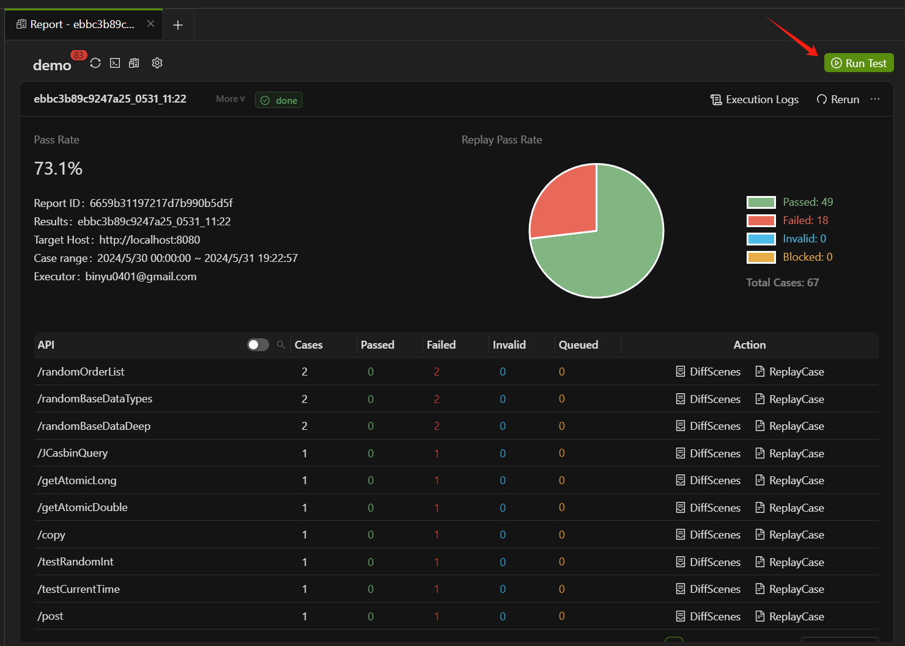

In the pop-up window, enter the following information sequentially:

- **Target Host**: The port address of the local/test environment where the replay test is to be conducted, which is the port address of the machine equipped with the Agent or the test machine. The complete **Target Host** should be protocol + domain name + port number (even the default port 80 needs to be entered manually).

- **Case Range**: Select the range of replay cases to replay the online requests recorded within this date range.

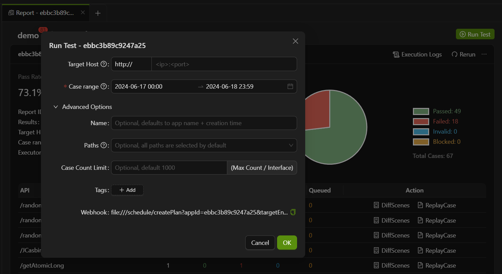

- **Name**: Customize the report name, with the default naming convention being **application name + creation time**.

- **Paths**: Select the interface paths that need to be replayed in this test. If not set, all cases under all paths will be replayed by default.

- **Case Count Limit**: Set the maximum number of replay cases for a single interface, with the default limit being 1000 cases per interface per replay.

- **Webhook**: Used for creating scheduled replay tasks, for more information, refer to [Scheduled Replay](Traffic%20Replay%20Test#scheduled-replay).

## Report overview

During the replay task, you can click on **Terminate the Replay** in the dropdown list at the top right of the report to interrupt the replay process.

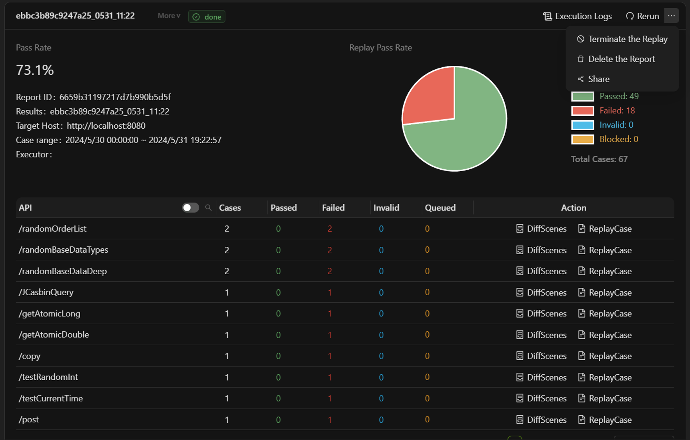

When the status of the replay task changes to **"done"**, the replay is complete, and a replay report is generated. The details are as follows:

- **Delete the Report**: Remove this replay report.

- **Rerun**: Conduct the replay again.

- **Execution Logs**: View the logs of the replay process.

- **Pass Rate**: The pass rate of the replay test cases (a test case is considered passed if there is no difference between the recorded and replayed return results).

- **API Pass Rate**: The pass rate for API testing.

- **API**: A list of all interfaces accessed during recording and replay, with the default display showing only the last part of the path. Click the button on the right to switch to the full path view.
  
- **Time consumed(s)**: The execution time for the replay test of this interface, measured in seconds.

- **Total Cases**: The number of test cases under this interface.

- **Passed, Failed, Invalid, Blocked**: These terms represent the number of test cases that passed, failed, are invalid, or were blocked during the replay, respectively.

## Analyze response message differences

 **Failed** in the interface indicates that the replay response differs from the recorded one. Select **DiffScenes** to analyze the differences.

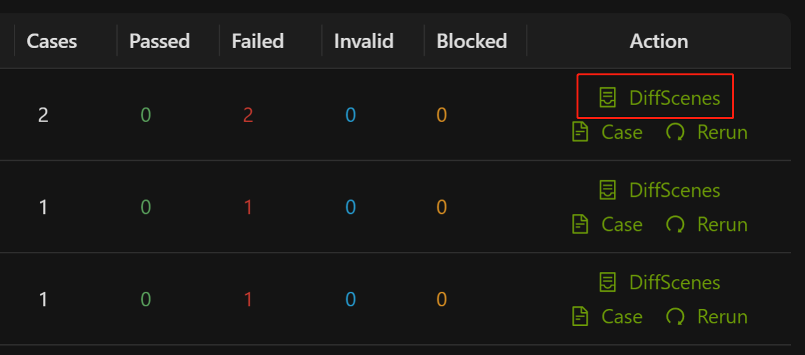

The replay test report provides a visual representation of the variances between the main and third-party calls during the recording and replay process. This feature allows users to easily understand and compare the differences between the recorded and replayed results. The report page presents a summary of the differences for all failed test cases and showcases a randomly selected test case for each scenario.

As shown in the diagram below, it indicates that for this particular interface, there is only one type of failure observed across all failed test cases (i.e., `/posts/2-HttpClient` call missing + `/posts-HttpClient` value diff). There are two points of differences highlighted:

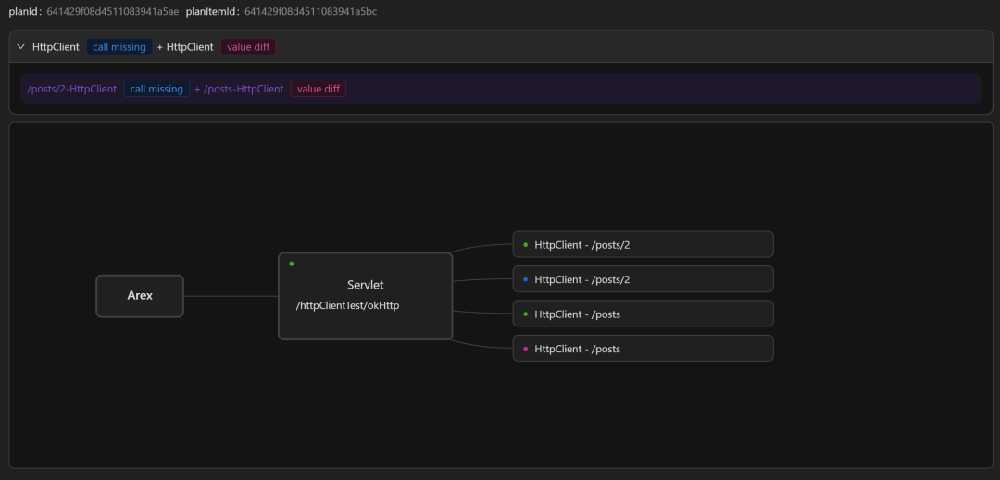

- `HttpClient` has a missing call to the third-party dependency `/posts/2` during replay, i.e. HttpClient does not make the request to `/posts/`2 correctly during replay.
- HttpClient's call to the third-party dependency `/posts` during replay results in a value diff relative to the recorded result.

🟢 indicates that there is no difference in the comparison results, as in the example above, the return result of the main path `/httpClientTest/okHttp` after replay is not different from the recording.

Select the node with **value diff** to view the difference in response message. 

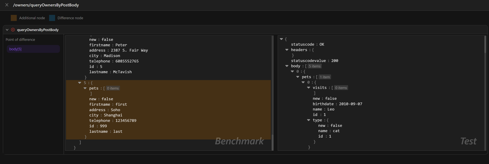

**Additional node**：The additional node in the return message after recording or replay. If there are any, the difference points are highlighted in orange in the message.

**Difference node**：Nodes that are different in the return message after recording and playback. If there are any, the difference points are highlighted in blue in the message.

If the node is causing interference with the comparison result, you can select the button on the right side of the node to configure it for ignoring. The next replay will skip the comparison for that particular node.

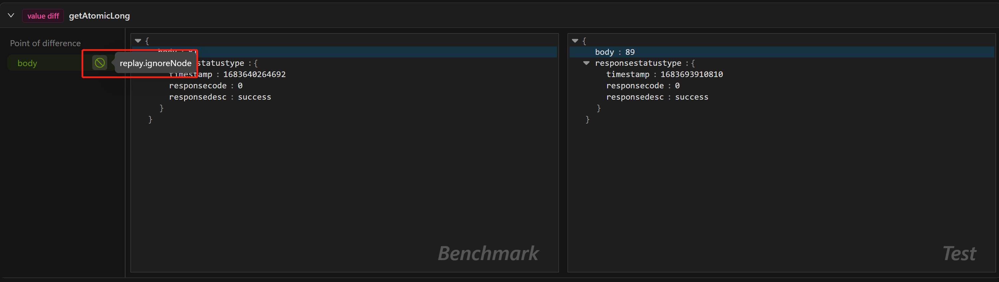

## Scheduled Replay

You can follow the steps below to set up a scheduled replay task:

1. Click "Start replay" and enter the host address of the target service. Then it will generate an Webhook (HTTP GET request) for creating the replay. The time range for the replay case is 24 hours prior to the time of the invocation.

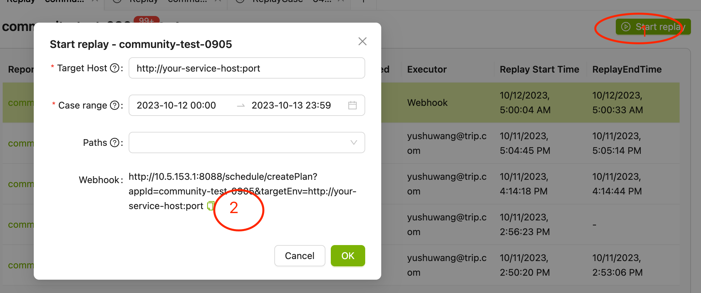

2. After getting the Webhook, you need a tool to trigger the creation:

- Take the Linux Crontab for example

  1. Create a file named "routine" and write the following line into it: `0 5 * * * /usr/bin/curl [the copied creation address from the first step]` (where "0 5 * * *" is a standard Linux cron expression, indicating that the command should be executed at 5 AM every day).

  2. Run the command `crontab routine` to load the scheduled task configured in the previous step.

  3. Run the command `crontab -l` to check if the scheduled task has been successfully written.

- Take GitLab CI/CD for example

  1. Set up a similar pipeline.

  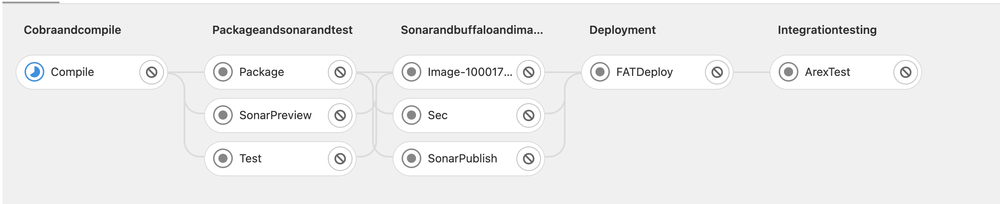

  2. In the ArexTest Job script, use curl to call the copied link from step 1.

  3. In the repository's CI/CD -> Schedules section, create a scheduled task to execute the pipeline.

  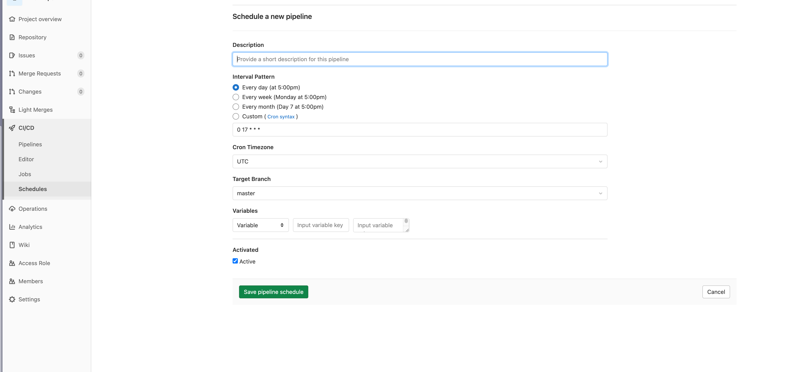

## Replay results callback

Replay result callback refers to the system calling the user-configured callback function interface after a replay testing, and transmitting the relevant information of the testing result to the user via a POST request. Users can process this information accordingly, such as monitoring and alerting, statistics and analysis, and triggering automated workflows.

### Config

Configure the `ReplayCallbackUrl` in the system settings. When a replay testing is done, the system will make a POST request to the URL.

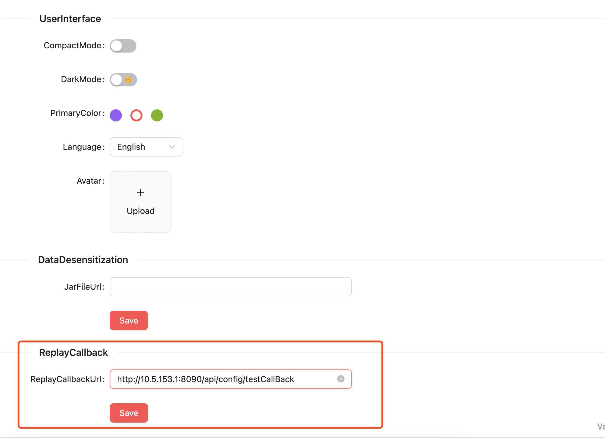

### Implement

To implement this functionality, you need to implement a callback function interface with the following parameters:

```java
public class CallbackInformRequestType {
  private String appId;
  private String appName;
  private String planName;
  private Integer status;
  private Integer totalCaseCount;
  private Integer successCaseCount;
  private Integer failCaseCount;
  private Integer errorCaseCount;
  private Integer waitCaseCount;
  private Double passRate;
  private Long elapsedMillSeconds;
  private String creator;
}
```
